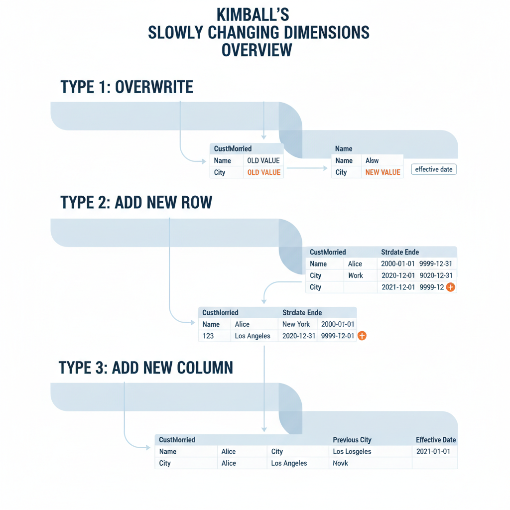
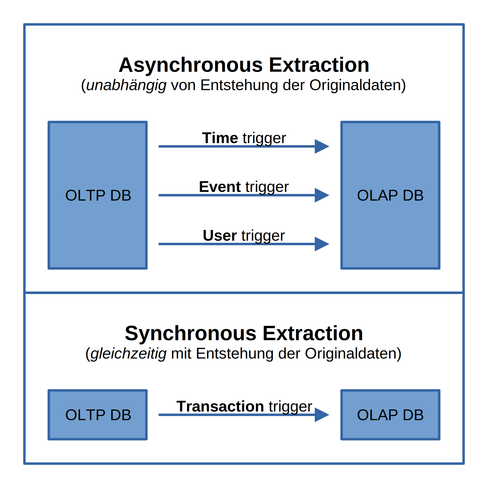
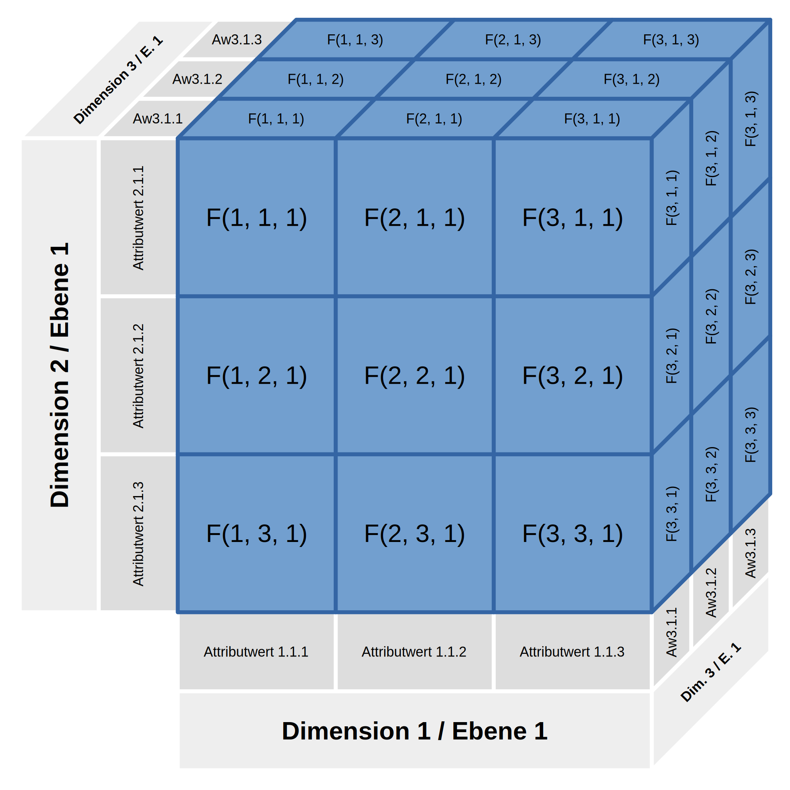
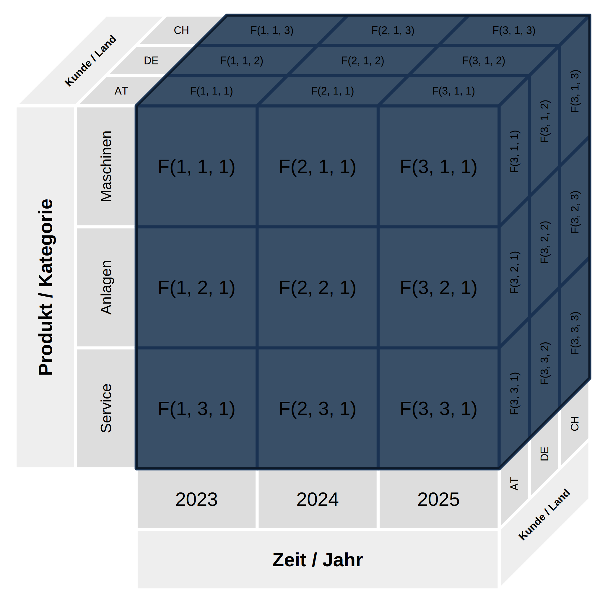
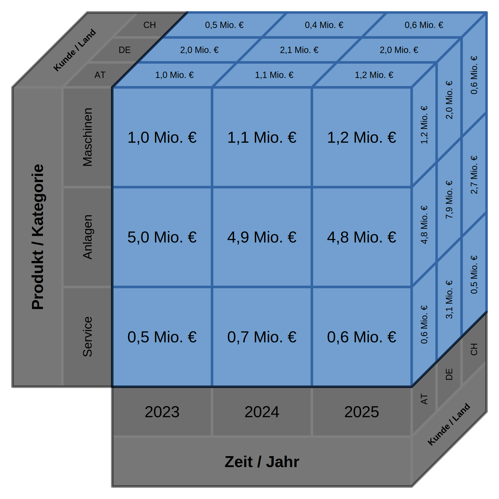
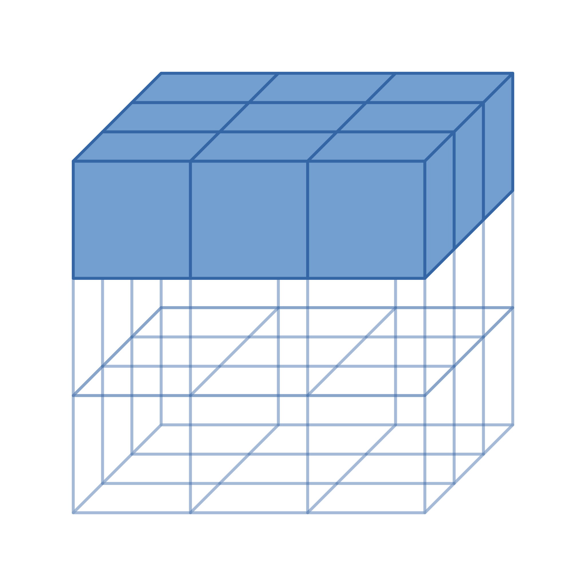
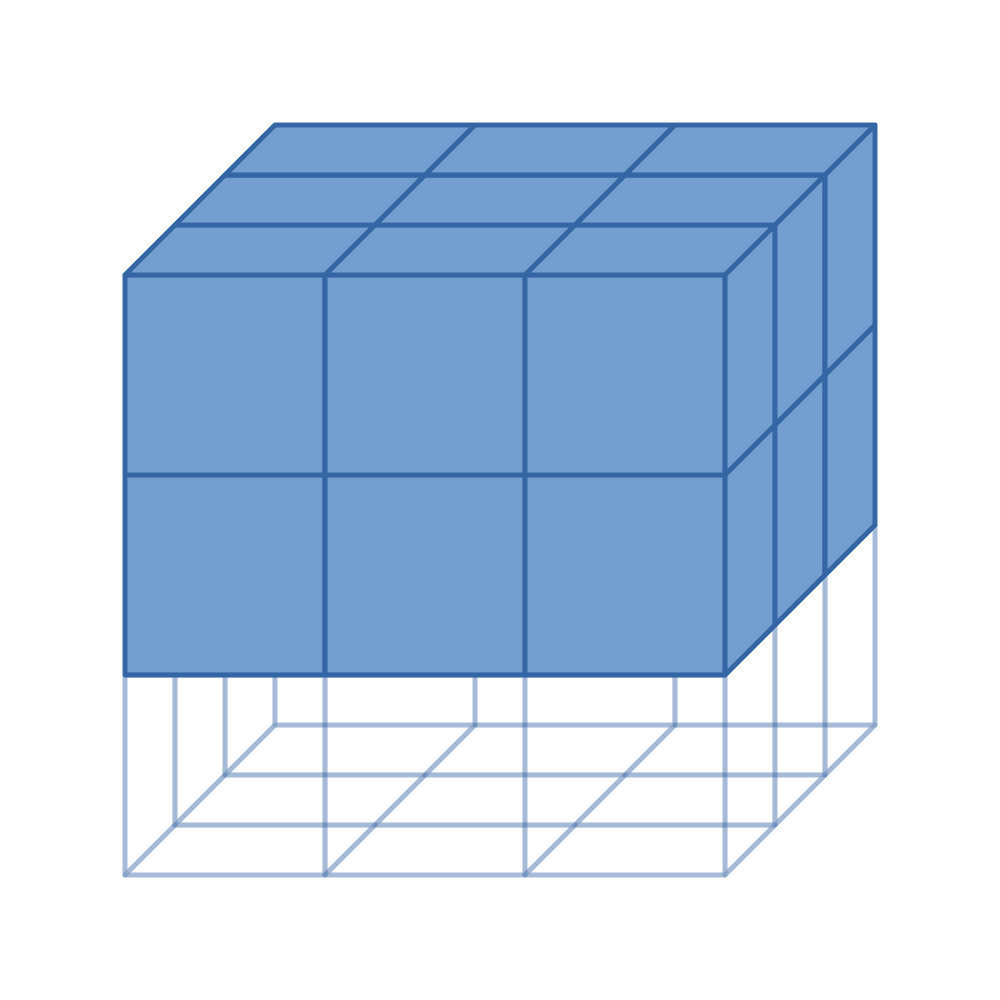
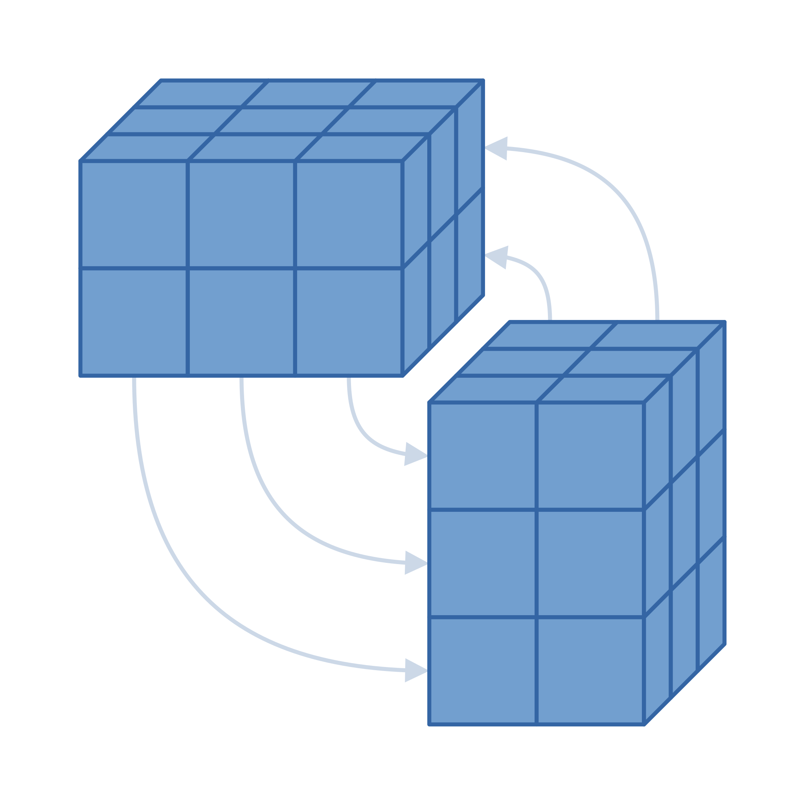
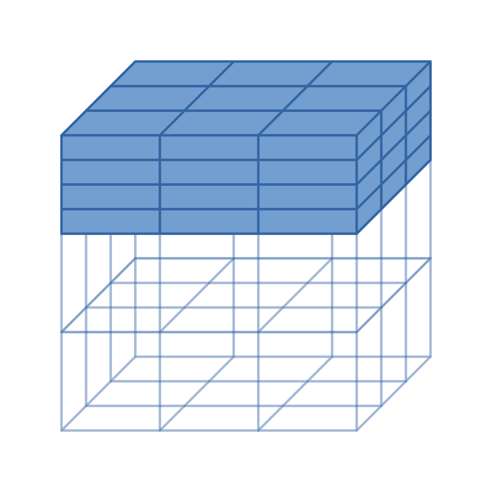

# Kapitel 3: Datenlager und Analysetechniken

Dieses dritte Kapitel umfasst die folgenden Abschnitte:

1. Datenlager-Schemata
1. Extract-Transform-Load
1. Online Analytical Processing

---

## Datenlager-Schemata

Es gibt drei typische Datenbank-Schemata für Datenlager bzw. -analysesysteme:

<div class="columns top">
<div>

**1. Stern-Schema**


</div>
<div>

**2. Schneeflocken-Schema**


</div>
<div>

**3. Galaxie-Schema**


</div>
</div>

---

<div class="columns">
<div>

### Stern-Schema

Das Stern-Schema ist wie folgt definiert:

- Mehrere **Dimensionstabellen** für die Dimensionenen, nach denen die Daten analysiert werden sollen
- Eine zentrale **Faktetabelle** mit den eigentlichen Kennwerten, die analysiert werden sollen
- Jeder Eintrag der Faktentabelle verweist auf die entsprechenden Einträge der Dimensionstabellen

</div>
<div>


</div>
</div>

---

<div class="columns">
<div>

### Stern-Schema (Beispiel)

Das Beispiel auf der rechten Seite zeigt die Umsetzung des Stern-Schemas für die Analyse von Vertriebsdaten:

- Dimensionen sind verkauften **Produkte**, **Ort** des Umsatzes, und **Zeitpunkt**
- Fakten sind die verkaufte **Menge** und der erzielte **Umsatz** pro Produkt, Ort und Zeitpunkt

*(Beispieldaten auf der folgenden Folie!)*

</div>
<div>


</div>
</div>

---

<div class="columns top">
<div>

**Tabelle *Fakt***

| <ins class="pfk">fk_1</ins> | <ins class="pfk">fk_2</ins> | <ins class="pfk">fk_3</ins> | Umsatz | Menge |
|-|-|-|-|-|
| 1 | 1 | 1 | 500€ | 5 |
| 1 | 1 | 2 | 450€ | 3 |
| 1 | 2 | 1 | 90€ | 1 |
| 1 | 2 | 2 | 140€ | 2 |
| 2 | 1 | 1 | ... | ... |
| 2 | 1 | 2 | ... | ... |
| 2 | 2 | 1 | ... | ... |
| 2 | 2 | 2 | ... | ... |

</div>
<div>

**Tabelle *Produkt***

| <ins>pk_1</ins> | Kategorie | Name |
|-|-|-|
| 1 | Thriller | Buch A |

**Tabelle *Ort***

| <ins>pk_2</ins> | Land | Bundesland | Stadt |
|-|-|-|-|
| 1 | AT | OÖ | Wels |

**Tabelle *Zeit***

| <ins>pk_3</ins> | Jahr | Quartal | Monat | Tag |
|-|-|-|-|-|
| 1 | 2025 | 1 | 2 | 14 |

</div>
</div>

---

<div class="columns">
<div>

### Dimensionshierarchie

Die Attribute der einzelnen Dimensionen modellieren in der Regel eine Hierarchie:

- **Dimension *Produkt*** - Kategorie und Name
- **Dimension *Ort*** - Land, Bundesland und Stadt
- **Dimension *Zeit*** - Jahr, Quartal, Monat und Tag

*Die Hierarchie ist für die Aggregation der Daten bei der Analyse wichtig!*

</div>
<div>

**Allgemein**


**Spezifisch**


</div>
</div>

---

### Dimensionsänderungen

Wenn eine Analysedatenbank über einen langen Zeitraum betrieben wird, kann es vorkommen, dass Änderungen an den Dimensionen durchgeführt werden sollen. Ralph Kimball hat 1996 in seinem Buch mehrere Arten beschrieben, damit umzugehen:

<div class="columns top">
<div>

**Typ 1 (Überschreiben)**


</div>
<div>

**Typ 2 (Historisieren)**


</div>
<div>

**Typ 3 (Erweitern)**


</div>
</div>

---

<div class="columns">
<div class="two">

### Dimensionsänderungen (Typ 1)

Im einfachsten Fall werden einfach die Einträge der Dimensionstabellen **überschrieben**.

Im Beispiel auf der Rechten Seite wird das **Land** und der **Name** eines **Lieferanten** nachträglich geändert.

**Beachte, dass dadurch ältere Fakten nachträglich einem neuen Land zugeordnet werden.**

Die Neuzuordnung kann in diesem Fall durchaus ein Problem darstellen, das man vermeiden möchte.

</div>
<div>

**Dimension *Lieferant***

*Vorher*

| <ins>PK</ins> | Land | Name |
|-|-|-|
| 1 | AT | Lieferant A |

*Nachher*

| <ins>PK</ins> | Land | Name |
|-|-|-|
| 1 | DE | Lieferant A' |

</div>
</div>

---

<div class="columns">
<div class="two">

### Dimensionsänderungen (Typ 2)

Um die Neuzuordnung von alten Fakten zu **vermeiden**, können die Einträge in der Dimensionstabelle **versioniert** werden.

Die Versionierung kann durch eine **zusätzliche Primärschlüsselspalte** für die Versionsnummer erreicht werden.

**Fakten** können (bzw. müssen) nun auf spezifische Versionen des Eintrags in der Dimensionstabelle verweisen.

*$\Rightarrow$ Evtl. Probleme bei Aggregation!*

</div>
<div>

**Dimension *Lieferant***

*Vorher*

| <ins>ID</ins> | <ins>Version</ins> | Land | Name |
|-|-|-|-|
| 1 | 0 | AT | Lieferant A |

*Nachher*

| <ins>ID</ins> | <ins>Version</ins> | Land | Name |
|-|-|-|-|
| 1 | 0 | AT | Lieferant A |
| 1 | 1 | DE | Lieferant A' |

</div>
</div>

---

<div class="columns">
<div class="two">

### Dimensionsänderungen (Typ 3)

Damit die Probleme bei der Aggre-gation zu umgehen, besteht auch die Möglichkeit, die Dimensions-tabelle zu **erweitern**.

Damit verweisen nun alle Fakten **auf denselben Eintrag** in der Dimen-sionstabelle, und der Eintrag bietet alle notwendigen Informationen.

*Die Tabelle kann jedoch sehr schnell sehr groß und ineffizient werden!*

</div>
<div>

**Dimension *Lieferant***

*Vorher*

| <ins>PK</ins> | Land | Name |
|-|-|-|
| 1 | AT | Lieferant |

*Nachher*

| <ins>PK</ins> | Land | LandNeu | Name | NameNeu |
|-|-|-|-|-|
| 1 | AT | Lieferant A | DE | Lieferant A' |

</div>
</div>

---

### Stern-Join

Die Abfrage von Daten aus Datenbanken, die nach dem Stern-Schema aufgebaut sind, folgt typischerweise einem einfachen Muster:

```sql
select Dimension_1.Attribut_1_1, ..., sum(Fakt.Kennwert_1), ...
    from Fakt
        inner join Dimension_1 on Fakt.fk_1 = Dimension_1.pk_1
        inner join Dimension_2 on Fakt.fk_2 = Dimension_2.pk_2
        inner join Dimension_3 on Fakt.fk_3 = Dimension_3.pk_3
        ...
    where <Bedingung>
    group by Dimension_1.Attribut_1_1, ...
    order by Dimension_1.Attribut_1_1, ..., sum(Fakt.Kennwert_1), ...
```

Die Faktentabelle wird zunächst mit den gewünschten Dimensionstabellen **gekreuzt**, bevor Fakten **selektiert** sowie die Fakten **gruppiert** und **sortiert** werden.

---

<div class="columns">
<div class="two">

### Datenredundanz

Das Stern-Schema speichert die Werte der Attribute von Dimensionen (z.B. *Kategorie*) potenziell redundant ab:

- Die redundante Speicherung benötigt grundsätzlich relativ **viel Speicherplatz**
- Jedoch ist die redundante Speicherung bei Abfragen auch relativ **performant**

*Es gibt eine Alternative zum Stern-Schema, das die Redundanz auflöst $\Rightarrow$ das Schneeflocken-Schema!*

</div>
<div>

**Dimensionstabelle *Produkt***

| <ins>PK</ins> | Kategorie | Name |
|-|-|-|
| 1 | Thriller | Buchtitel A |
| 2 | Thriller | Buchtitel B |
| 3 | Science Fiction | Buchtitel C |
| 4 | Science Fiction | Buchtitel D |
| 5 | Sachbuch | Buchtitel E |
| 6 | Sachbuch | Buchtitel F |

</div>
</div>

---

<div class="columns">
<div>

### Schneeflocken-Schema

Beim Schneeflocken-Schema werden die Dimensionstabellen des Stern-Schemas potenziell in mehrere Tabellen zerlegt:

- Die Faktentabelle bleibt grund-sätzlich bestehen
- Die Dimensionstabellen könnten hingegen Untertabellen haben
- Die Hierarchie der Tabellen spiegelt die Dimensionshierarchie wieder

</div>
<div >


</div>
</div>

---

<div class="columns">
<div>

### Schneeflocken-Schema (Beispiel)

Das Beispiel auf der rechten Seite zeigt die Umsetzung in der Praxis:

- Die Faktentabelle enthält wieder **Umsatz-** und **Stückzahlen**
- Die Fakten beziehen sich jeweils auf ein **Produkt** und einen **Kalendertag**
- Für das *Produkt* ist zusätzlich die **Kategorie** und die **Farbe** definiert
- Der *Kalendertag* ist verweißt hingegen auf **Monat** und **Jahr**

</div>
<div>



</div>
</div>

---

<div class="columns">
<div>

**Dimension *Produkt***

| <ins>PK_1</ins> | <ins class="fk">FK_1_1</ins> | <ins class="fk">FK_1_2</ins> | ProduktName |
|-|-|-|-|
| 1 | 1 | 1 | Buch A

**Dimension *Kategorie***

| <ins>PK_1_1</ins> | KategorieName |
|-|-|
| 1 | Thriller |

**Dimension *Farbe***

| <ins>PK_1_2</ins> | FarbeName |
|-|-|
| 1 | Grün |

</div>
<div>

**Dimension *Tag***

| <ins>PK_2</ins> | <ins class="fk">FK_2_1</ins> | TagNummer |
|-|-|-|
| 1 | 1 | 15 |

**Dimension *Monat***

| <ins>PK_2_1</ins> | <ins class="fk">FK_2_1_1</ins> | MonatNummer |
|-|-|-|
| 1 | 1 | 8 |

**Dimension *Jahr***

| <ins>PK_2_1_1</ins> | JahrNummer |
|-|-|
| 1 | 2025 |

</div>
</div>

---


### Dimensionshierarchie

Wie erwähnt, wird die Hierarchie der Dimen-sionen durch die Tabellenstuktur abgebildet:

- **Fakten** sind direkt mit der untersten Ebene der Hierarchie verbunden
- Jede **Ebene** der Hierarchie kann weitere Überebenen definieren und verweisen
- Mehrere **Überebenen** führen zu einer unabhängigen Verzweigung
- Die **obersten Ebenen** definieren die maximale Aggregationsstufe

---



### Dimensionsänderungen

Das **Problem** der Änderungen an den Einträgen der Dimensionstabellen bleibt grundsätzlich bestehen.

Genauso können die bereits eingeführten **Lösungsansätze** (Typ 1, 2 und 3) angewendet werden.

Änderungen beziehen sich dabei auf die entsprechenden **Ebenen** der Hierarchie (z.B. *Kategorie*).

---

### Schneeflocken-Join

Auch für das Schneeflocken-Schema gibt es wieder ein typisches SQL-Anfragemuster, welches deutlich mehr Join-Operationen benötigt als beim Stern-Schema:

```sql
select Dimension_1.Attribut_1_1, ..., sum(Fakt.Kennwert_1), ...
    from Fakt
        inner join Dimension_1 on Fakt.fk_1 = Dimension_1.pk_1
            inner join Dimension_1_1 on Dimension_1.fk_1_1 = Dimension_1_1.pk_1_1
                ...
            inner join Dimension_1_2 on Dimension_1.fk_1_2 = Dimension_1_2.pk_1_2
                ...
            ...
        inner join Dimension_2 on Fakt.fk_2 = Dimension_2.pk_2
            ...
    where <Bedingung>
    group by Dimension_1.Attribut_1_1, ...
    order by Dimension_1.Attribut_1_1, ..., sum(Fakt.Kennwert_1), ...
```

---


### Fakteneinschränkung

Schließlich besteht beim Stern- und beim Schneeflocken-Schema noch das Problem, dass **alle Fakten mit allen Dimensionen** verknüpft werden müssen.

Es gibt jedoch Situationen, in denen man **mehrere heterogene Fakten** gleichzeitig analysieren will, die sich vielleicht nur in wenigen Dimensionen überschneiden.

*Für diese komplexeren Anwendungsfälle gibt es ein weiteres Schema $\Rightarrow$ das Galaxie-Schema.*

---

<div class="columns">
<div>

### Galaxie-Schema

Das Galaxie-Schema zeichnet sich durch **mehrere Faktentabellen** aus.

Faktentabellen haben **eigene** und **geteilte Dimensionstabellen**.

Dimensionstabellen können schließlich **hierarchisch** aufgebaut sein.

</div>
<div class="two">


</div>
</div>

---

<div class="columns">
<div>

### Galaxie-Schema (Beispiel)

Das Beispiel auf der rechten Seite zeigt die Abbildung von Vertriebs- und Lager-ungsdaten in einem Schema:

- Die **Vertriebsdaten** umfassen Um-sätze und Stückzahlen kategorisiert nach Kunde und Produkt
- Die **Lagerungsdaten** umfassen Stückzahlen kategorisiert nach Produkt und Lager

*$\Rightarrow$ Aggregation der Fakten möglich!*

</div>
<div>



</div>
</div>

---


### Dimensionshierarchie

In einem Galaxie-Schema kann die hierarchische Struktur von Dimen-sionen wie beim Stern-Schema abgebildet werden.

Genauso kann die hierarchische Struktur der Dimensionen wie beim Schneeflocken-Schema abgebildet werden.

*Somit erhält man die gleich Vor- und Nachteile bzgl. Datenredundanz!*

---


### Dimensionsänderungen

Selbes gilt für die Abbildung von Änderungen an den Einträgen der Dimensionstabellen.

Die Abbildung kann wieder nach Typ 1 (überschreiben), Typ 2 (historisier-en) oder Typ 3 (erweitern) erfolgen.

Daraus ergeben sich dieselben Vor- und Nachteile, wie bereits vorher besprochen.

---

### Galaxie-Join

Schließlich kann auch für einen Galaxie-Join wieder ein typisches Muster indentifiziert werden, das wie folgt aussieht:

```sql
select Dimension_1.Attribut_1_1, ..., sum(Fakt_1.Kennzahl_1_1), ...
    from Fakt_1, Fakt_2, ...
        inner join Dimension_1 on (Fakt_1.fk_1 = Dimension_1.pk_1 and Fakt_2.fk_1 = Dimension_1.pk_1)
            inner join Dimension_1_1 on Dimension_1.fk_1_1 = Dimension_1_1.pk_1_1
                ...
            ...
        ...
    where <Bedingung>
    group by Dimension_1.Attribut_1_1, ...
    order by Dimension_1.Attribut_1_1, ..., sum(Fakt_1.Kennzahl_1_1)
```

*Beachte, dass der Join das kartesische Produkte mehrere Faktentabellen enthält, deren Kennwerte dann gemeinsam aggregiert werden können.*

---


### Aufgaben für das **Selbststudium**

So kannst du dein Verständnis noch weiter vertiefen:

- Entwickeln Sie ein Stern-Schema für die Analyse der Daten eines produzierenden Betriebs
- Überführen Sie das Stern-Schema in ein Schneeflocken- und ein Galaxie-Schema
- Formulieren Sie SQL-Anfragen für die unterschiedlichen Varianten des Schemas

---


## Extract-Transform-Load

Extract-Transform-Load beschreibt den Prozess für die Befüllung der Datenlager in drei Schritten:

1. **Extraktion** der Orginaldaten aus den Quellsystemen
1. **Transformation** der extrahierten Daten für das Datenlager
1. **Laden** der transformierten Daten in das Datenlager

---


### Begriffsdefinition

Im folgenden Treffen wir eine Unterscheidung zwischen zwei Arten von Systemen bzw. Datenbanken:

- **Online Transaction Processing (OLTP)** Systeme verarbeiten Transaktionen im Tagesgeschäft
- **Online Analytical Processing (OLAP)** Systeme verarbeiten Anfragen von Datenanalysten

*Technisch können dieselben Daten-banktechnologien verwendet werden!*

---



### Schritt 1: Extraktion

Zunächst stellt sich die Frage, *wann* die Extraktion ausgeführt werden soll. Wir unterscheiden **zwei Prinzipien**:

- **Asynchrone Extraktion** erfolgt unabhängig vom Zeitpunkt der Entstehung von Daten
- **Synchrone Extraktion** erfolgt gleichzeitig mit der Entstehung der Originaldaten

---

### **Asynchrone** Extraktion

Bei der asynchronen Extraktion können wieder drei untergeordnete Prinzipien unterschieden werden, die je nach Anwendungsfall eingesetzt werden können:

- **Periodische Extraktion** überträgt die Daten aus den OLTP-Datenbanken zu definierten Zeiten in die OLAP-Datenbanken (z.B. am Wochenende)
- **Ereignisgesteuerte Extraktion** überträgt die Daten aus den OLTP-Datenbanken zu definierten Ereignissen in die OLAP-Datenbanken (z.B. nach 100 Transaktionen)
- **Anfragegesteuerte Extraktion** überträgt die Daten aus den OLTP-Datenbanken auf Nutzeranfrage in die OLAP-Datenbanken

*Durch diese Techniken sollen **zusätzliche Lasten** auf den OLTP-Datenbanken **vermieden** werden. Jedoch arbeiten **Analysen** tendenziell mit **"veralteten" Daten**.*

---


### **Synchrone** Extraktion

Bei der synchronen Extraktion führen Transaktionen auf OLTP-Datenbanken zu einer **sofortigen Aktualisierung** der Daten in OLAP-Datenbanken.

- Der **Vorteil** ist, dass Analysen immer mit den neuesten Daten arbeiten.
- Der **Nachteil** sind zusätzliche Lasten auf den OLTP-/OLAP-Datenbanken.

---

### Schritt 2: Transformation

Nach der Extraktion wird der Schritt der Transformation ausgeführt. Dabei können zwei Arten von Transformationen unterschieden werden:

- **Syntaktische Transformationen** verändern nicht den Inhalt der Daten, sondern nur deren Darstellung (z.B. Datumsformat von YYYYMMDD nach ISO-8601 oder Geschlecht von `male/female` nach `0/1`)
- **Semantische Transformation** verändern nicht nur die Darstellung der Daten, sondern auch deren Inhalt (z.B. Aggregation von Umsatzdaten oder Anreicherung mit Daten aus anderen Quellen)

*Ziel ist die Erstellung **homogener Daten** für die OLAP-Systeme, um Analysen zu vereinfachen (insbesondere bei inhomogenen OLTP-Systemen).*

---

### Schritt 3: Laden

Im letzten Schritt werden die transformierten Daten in die OLAP-Systeme geladen und den Analysten somit bereitgestellt:

- Dabei kann es notwendig sein, **veraltete Daten** aus den OLAP-Systemen wieder zu **entfernen** (z.B. wenn nur die Umsätze enthalten sein sollen, die maximal 365 Tage alt sind)
- Außerdem kann es erforderlich sein, in diesem Schritt die **Dimensionstabellen** nach den Verfahren, die breits im vorigen Abschnitt besprochen wurden (Typ 1, 2 und 3), zu **aktualisieren**

*Das Laden **belastet** die **OLAP-Systeme** und kann je nach Umfang dazu führen, dass die Systeme für Analysen zeitweise **nicht** bereitstehen.*

---


### Aufgaben für das **Selbststudium**

So kannst du dein Verständnis noch weiter vertiefen:

- Definieren Sie eine geeignete Strategie für die Extraktion von Daten aus der Produktion
- Sammeln Sie Ideen für notwen-dige Transformationen auf den Daten der Produktion
- Nennen Sie Beispiele für veraltete Daten, die beim Laden entfernt werden sollen

---


## Online Analytical Processing

OLAP beschreibt eine spezielle Methode für die Analyse von Daten in einem Datenlager und beinhaltet:

- Den **OLAP Würfel** für die Darstellung der Daten
- Die **OLAP Operationen** für die Manipulation der Daten

*Im Folgenden gehen wir auf beide Konzepte detaillierter ein.*

---

<div class="columns">
<div>

### OLAP Würfel

Darstellung der Daten als Würfel:

- Die **Seiten** des Würfels entsprechen den **Dimensionen** (z.B. Zeit, Kunde, Produkt)
- Für jede Dimension ist die **Hierarchieebene** festgelegt, auf der aggregiert wird (z.B. Jahr)
- Die **Inhalte** des Würfels entsprechen der Aggregation der **Fakten** (z.B. Summe des Umsatzes, ...)

</div>
<div>



</div>
</div>

---

<div class="columns">
<div>

### OLAP Würfel Beispiel (Dimensionen)

Zur Verdeutlichung hier ein Beispiel:

- Die **erste Dimension** entspricht der *Zeit* und ist aufgelöst nach *Jahren* (z.B. *2025*)
- Die **zweite Dimension** entspricht dem *Produkt* und ist aufgelöst nach *Kategorien* (z.B. *Maschinen*)
- Die **dritte Dimension** entspricht dem *Kunden* und ist aufgelöst nach *Ländern* (z.B. *AT*)

</div>
<div>



</div>
</div>

---

<div class="columns">
<div>

### OLAP Würfel Beispiel (Fakten)

Und nun zu den Inhalten des Würfels:

- Die Inhalte könnten aggregierte **Umsatzzahlen** für die jeweiligen Gruppen sein (z.B. `SUM(...)`)
- Die Gruppe ergibt sich aus den **Attributwerten** der gewählten **Dimensionsebenen**, z.B.:
  - $(2023, Maschinen, AT)$
  - $(2024, Anlagen, DE)$

</div>
<div>



</div>
</div>

---

### OLAP Würfel SQL-Abfrage

Und so sieht das Muster für die zugehörige SQL-Abfrage aus, welche Daten aus einer Datenbank ausliest, die nach dem Stern-Schema aufgebaut ist:

```sql
select Dimension_1.Attribut_1_1, Dimension_2.Attribut_2_1, ..., sum(Fakt.Kennwert_1)
    from Fakt
        inner join Dimension_1 on Fakt.fk_1 = Dimension_1.pk_1
        inner join Dimension_2 on Fakt.fk_2 = Dimension_2.pk_2
        ...
    group by Dimension_1.Attribut_1_1, Dimension_2.Attribut_2_1, ...
    order by Dimension_1.Attribut_1_1, Dimension_2.Attribut_2_1, ...
```

*Beachte, dass eine SQL-Abfrage prinzipiell die Daten für einen Würfel mit beliebig vielen Dimensionen liefern kann.*

---

<div class="columns">
<div>

### OLAP Würfel SQL-Ergebnis

Und so sieht die allgemeine Form des Ergebnisses der SQL-Abfrage aus:

- Das Ergebnis ist wie zu erwarten eine Menge von Tupeln
- Die Tupel entsprechen den Kombi-nationen der Attributwerte $aw_x$ für die Dimensionen und deren Ebenen
- Für jedes dieser Tupel wird des Weiteren die Aggregationsfunktion $F$ berechnet

</div>
<div>

| $D_1.A_{1.1}$ | ... | $D_n.A_{n.1}$ | $F(\cdot)$ |
|-|-|-|-|
| $aw_{1.1.1}$ | ... | $aw_{n.1.1}$ | $F(1, ..., 1)$ |
| ... | ... | ... | ... |
| $aw_{1.1.1}$ | ... | $aw_{n.1.m}$ | $F(1, ..., m)$ |
| ... | ... | ... | ... |
| $aw_{1.1.k}$ | ... | $aw_{n.1.1}$ | $F(k, ..., 1)$ |
| ... | ... | ... | ... |
| $aw_{1.1.k}$ | ... | $aw_{n.1.m}$ | $F(k, ..., m)$ |

</div>
</div>

---

### OLAP Würfel SQL-Ergebnis (Beispiel)

Auf unser voriges Beispiel angewendet sieht die Ergebnisrelation somit wie folgt aus:

| <ins>Zeit.Jahr</ins> | <ins>Produkt.Kategorie</ins> | <ins>Kunde.Land</ins> | $F(\cdot)$ |
|-|-|-|-|
| 2023 | Maschinen | AT | $F(2023, Maschinen, AT) = 1000k$ |
| 2023 | Maschinen | DE | $F(2023, Maschinen, DE) = 2000k$ |
| 2023 | Maschinen | CH | $F(2023, Maschinen, CH) = 500k$ |
| ... | ... | ... | ... |
| 2025 | Service | AT | $F(2025, Service, AT) = 600k$ |
| 2025 | Service | DE | $F(2025, Service, DE) = 3100k$ |
| 2025 | Service | CH | $F(2025, Service, CH) = 500k$ |

---

### OLAP Operationen

OLAP unterscheidet eine Reihe von Basisoperationen, welche für die Manipulation der Daten in einem OLAP-Würfel verwendet werden können:

<div class="columns top">
<div>

**Slice**



</div>
<div>

**Dice**



</div>
<div>

**Pivot**



</div>
<div>

**Drill-Down**



</div>
</div>

*Als Analyst arbeitet man sich mithilfe dieser Operationen schnell und ohne SQL-Kenntnisse durch den Datenbestand.*

---

### Operation **Slice**

Die Operation *Slice* **entfernt alle Fakten**, die in einer Dimension (z.B. den *Vertriebskanal*) **nicht** einem speziellen Wert zugeordnet sind (z.B. *Partner*):


---

### Operation **Slice** (SQL-Abfrage)

Und so sieht das Muster einer SQL-Abfrage aus, welche die Operation *Slice* auf einen Stern-Schema durchführt:

```sql
select Dimension_1.Attribut_1_1, Dimension_2.Attribut_2_1, Dimension_2.Attribut_3_1, sum(Fakt.Kennwert_1)
    from Fakt
        inner join Dimension_1 on Fakt.fk_1 = Dimension_1.pk_1
        inner join Dimension_2 on Fakt.fk_2 = Dimension_2.pk_2
        inner join Dimension_3 on Fakt.fk_3 = Dimension_3.pk_3
    where Dimension_3.Attribute_3_1 = <Wert>
    group by Dimension_1.Attribut_1_1, Dimension_2.Attribut_2_1, Dimension_2.Attribut_3_1
    order by Dimension_1.Attribut_1_1, Dimension_2.Attribut_2_1, Dimension_2.Attribut_3_1
```

*Beachte die **Selektionsbedingung**, die gegenüber der ursprünglichen SQL-Abfrage für den OLAP Würfel **hinzugefügt** wurde.*

---

### Operation **Dice**

Die Operation *Dice* **entfernt alle Fakten**, die in einer Dimension (z.B. *Produkt*) einem speziellen Wert zugeordnet sind (z.B. *Computer & Laptops*):


---

### Operation **Dice** (SQL-Abfrage)

Und so sieht wieder das Muster einer SQL-Abfrage aus, welche die Operation *Dice* auf einem Stern-Schema durchführt:

```sql
select Dimension_1.Attribut_1_1, Dimension_2.Attribut_2_1, Dimension_2.Attribut_3_1, sum(Fakt.Kennwert_1)
    from Fakt
        inner join Dimension_1 on Fakt.fk_1 = Dimension_1.pk_1
        inner join Dimension_2 on Fakt.fk_2 = Dimension_2.pk_2
        inner join Dimension_3 on Fakt.fk_3 = Dimension_3.pk_3
    where Dimension_3.Attribute_2_1 != <Wert>
    group by Dimension_1.Attribut_1_1, Dimension_2.Attribut_2_1, Dimension_2.Attribut_3_1
    order by Dimension_1.Attribut_1_1, Dimension_2.Attribut_2_1, Dimension_2.Attribut_3_1
```

*Beachte die **leicht veränderte Selektionsbedingung** gegenüber die Variante für die Operation Slice!*

---

### Operation **Pivot**

Die Operation *Pivot* **tauscht die Achsen** des Würfels (z.B. *Produkt* und *Vertriebskanal*) des Würfels in der Darstellung auf dem Bildschirm:


---

### Operation **Pivot** (SQL-Abfrage)

Auch für die Operation *Pivot* kann ein Muster für die SQL-Abfrage definiert werden, welches auf dem Stern-Schema operiert:

```sql
select Dimension_3.Attribut_3_1, Dimension_2.Attribut_2_1, Dimension_1.Attribut_1_1, sum(Fakt.Kennwert_1)
    from Fakt
        inner join Dimension_3 on Fakt.fk_3 = Dimension_3.pk_3
        inner join Dimension_2 on Fakt.fk_2 = Dimension_2.pk_2
        inner join Dimension_1 on Fakt.fk_1 = Dimension_1.pk_1
    group by Dimension_3.Attribut_3_1, Dimension_2.Attribut_2_1, Dimension_1.Attribut_1_1
    order by Dimension_3.Attribut_3_1, Dimension_2.Attribut_2_1, Dimension_1.Attribut_1_1
```

*Achte auf die **veränderte Reihenfolge der Dimensionen** sowohl bei der **Projektion** als auch beim **Join**, der **Gruppierung**, und der **Sortierung**!*

---

### Operation **Drill-Down**

Die Operation *Drill-Down* entspricht der Operation *Slice* (z.B. *Konsolen*) gefolgt von einer Entnestung der Fakten durch eintauchen in die Slice-Dimension (z.B. *Produkt*).


---

### Operation **Drill-Down** (SQL-Abfrage)

Wie gehabt, hier wieder das Muster für eine SQL-Abfrage, welche die Operation *Drill-Down* auf einem Stern-Schema ausführt:

```sql
select Dimension_1.Attribut_1_1, Dimension_2.Attribut_2_2, Dimension_2.Attribut_3_1, sum(Fakt.Kennwert_1)
    from Fakt
        inner join Dimension_1 on Fakt.fk_1 = Dimension_1.pk_1
        inner join Dimension_2 on Fakt.fk_2 = Dimension_2.pk_2
        inner join Dimension_3 on Fakt.fk_3 = Dimension_3.pk_3
    where Dimension_2.Attribut_2_1 = <Wert>
    group by Dimension_1.Attribut_1_1, Dimension_2.Attribut_2_2, Dimension_2.Attribut_3_1
    order by Dimension_1.Attribut_1_1, Dimension_2.Attribut_2_2, Dimension_2.Attribut_3_1
```

*Beachte die hinzugefügte **Selektion auf Dimension 2/Ebene 1** sowie die veränderte **Projektion, Gruppierung, und Sortierung auf Dimension 2/Ebene 2**.*

---


### Aufgaben für das **Selbststudium**

So kannst du dein Verständnis noch weiter vertiefen:

- Zeichnen Sie einen OLAP-Würfel für das Datenlager-Schema eines produzierenden Betriebs
- Wenden Sie die Operation Drill-Down für einen ausgewählten Wert einer beliebigen Dimension manuell an
- Setzen Sie schließlich dieselbe Operation noch in SQL um.