# Kapitel 3: Datenlager und Analysetechniken

Dieses dritte Kapitel umfasst die folgenden Abschnitte:

1. Datenbank-Schemata
1. Extract-Transform-Load
1. Online Analytical Processing

---

## Datenbankschemata

**Sternschema**

**Schneeflockenschema**

**Galaxieschema**

---

### Sternschema

Das Sternschema ist wie folgt definiert:

- Mehrere **Dimensionstabellen** für die Dimensionenen, nach denen die Daten analysiert werden sollen
- Eine zentrale **Faktetabelle** mit den eigentlichen Kennwerten, die analysiert werden sollen
- Jeder Eintrag der Faktentabelle verweist auf die entsprechenden Einträge der Dimensionstabellen

---

### Sternschema (Beispiel)

Das Beispiel auf der rechten Seite zeigt die Umsetzung des Sternschemas für die Analyse von Vertriebsdaten:

- Dimensionen sind verkauften **Produkte**, **Ort** des Umsatzes, und **Zeitpunkt**
- Fakten sind die verkaufte **Menge** und der erzielte **Umsatz** pro Produkt, Ort und Zeitpunkt

*(Beispieldaten auf der folgenden Folie!)*

---

**Tabelle *Fakt***

| fk_1 | fk_2 | fk_3 | Umsatz | Menge |
|-|-|-|-|-|
| 1 | 1 | 1 | 500€ | 5 |
| 1 | 1 | 2 | 450€ | 3 |
| 1 | 2 | 1 | 90€ | 1 |
| 1 | 2 | 2 | 140€ | 2 |
| 2 | 1 | 1 | ... | ... |
| 2 | 1 | 2 | ... | ... |
| 2 | 2 | 1 | ... | ... |
| 2 | 2 | 2 | ... | ... |

**Tabelle *Produkt***

| pk_1 | Name | Kategorie |
|-|-|-|
| 1 | Buch A | Thriller |

**Tabelle *Ort***

| pk_2 | Land | Bundesland | Stadt |
|-|-|-|-|
| 1 | AT | OÖ | Wels |

**Tabelle *Zeit***

| pk_3 | Jahr | Quartal | Monat | Tag |
|-|-|-|-|-|
| 1 | 2025 | 1 | 2 | 14 |

---

### Schneeflockenschema

TODO

---

### Schneeflockenschema (Beispiel)

---

### Galaxieschema

TODO

---

### Galaxieschema (Beispiel)

---

## Extract-Transform-Load

---

### Online Analytical Processing