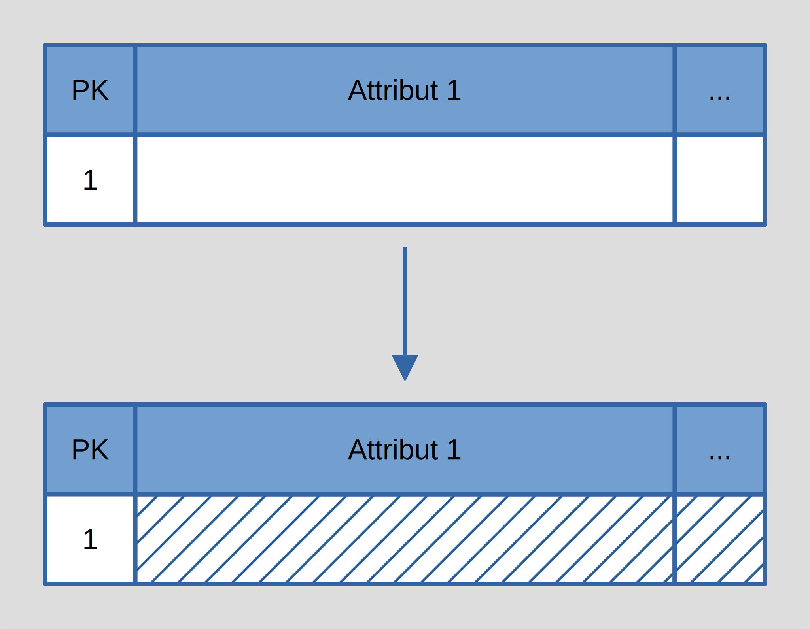
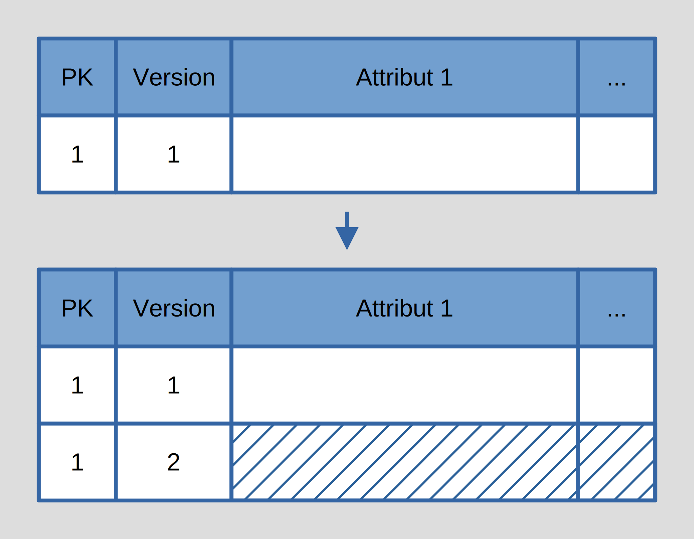
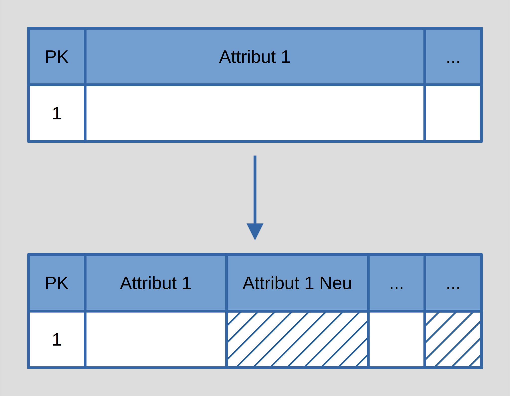

# Kapitel 3: Datenlager und Analysetechniken

Dieses dritte Kapitel umfasst die folgenden Abschnitte:

1. Datenbank-Schemata
1. Extract-Transform-Load
1. Online Analytical Processing

---

## Datenbank-Schemata

Es gibt drei typische Datenbank-Schemata für Datenanalysesysteme:

<div class="columns top">
<div>

**1. Sternschema**


</div>
<div>

**2. Schneeflockenschema**


</div>
<div>

**3. Galaxieschema**


</div>
</div>

---

<div class="columns">
<div>

### Sternschema

Das Sternschema ist wie folgt definiert:

- Mehrere **Dimensionstabellen** für die Dimensionenen, nach denen die Daten analysiert werden sollen
- Eine zentrale **Faktetabelle** mit den eigentlichen Kennwerten, die analysiert werden sollen
- Jeder Eintrag der Faktentabelle verweist auf die entsprechenden Einträge der Dimensionstabellen

</div>
<div>


</div>
</div>

---

<div class="columns">
<div>

### Sternschema (Beispiel)

Das Beispiel auf der rechten Seite zeigt die Umsetzung des Sternschemas für die Analyse von Vertriebsdaten:

- Dimensionen sind verkauften **Produkte**, **Ort** des Umsatzes, und **Zeitpunkt**
- Fakten sind die verkaufte **Menge** und der erzielte **Umsatz** pro Produkt, Ort und Zeitpunkt

*(Beispieldaten auf der folgenden Folie!)*

</div>
<div>


</div>
</div>

---

<div class="columns top">
<div>

**Tabelle *Fakt***

| <ins class="pfk">fk_1</ins> | <ins class="pfk">fk_2</ins> | <ins class="pfk">fk_3</ins> | Umsatz | Menge |
|-|-|-|-|-|
| 1 | 1 | 1 | 500€ | 5 |
| 1 | 1 | 2 | 450€ | 3 |
| 1 | 2 | 1 | 90€ | 1 |
| 1 | 2 | 2 | 140€ | 2 |
| 2 | 1 | 1 | ... | ... |
| 2 | 1 | 2 | ... | ... |
| 2 | 2 | 1 | ... | ... |
| 2 | 2 | 2 | ... | ... |

</div>
<div>

**Tabelle *Produkt***

| <ins>pk_1</ins> | Kategorie | Name |
|-|-|-|
| 1 | Thriller | Buch A |

**Tabelle *Ort***

| <ins>pk_2</ins> | Land | Bundesland | Stadt |
|-|-|-|-|
| 1 | AT | OÖ | Wels |

**Tabelle *Zeit***

| <ins>pk_3</ins> | Jahr | Quartal | Monat | Tag |
|-|-|-|-|-|
| 1 | 2025 | 1 | 2 | 14 |

</div>
</div>

---

<div class="columns">
<div>

### Dimensionshierarchie

Die Attribute der einzelnen Dimensionen modellieren in der Regel eine Hierarchie:

- **Dimension *Produkt*** - Kategorie und Name
- **Dimension *Ort*** - Land, Bundesland und Stadt
- **Dimension *Zeit*** - Jahr, Quartal, Monat und Tag

*Die Hierarchie ist für die Aggregation der Daten bei der Analyse wichtig!*

</div>
<div>

**Allgemein**



**Spezifisch**



</div>
</div>

---

### Dimensionsänderungen

Wenn eine Analysedatenbank über einen langen Zeitraum betrieben wird, kann es vorkommen, dass Änderungen an den Dimensionen durchgeführt werden sollen. Ralph Kimball hat 1996 in seinem Buch mehrere Arten beschrieben, damit umzugehen:

<div class="columns top">
<div>

**Typ 1 (Überschreiben)**



</div>
<div>

**Typ 2 (Historisieren)**



</div>
<div>

**Typ 3 (Erweitern)**



</div>
</div>

---

<div class="columns">
<div class="two">

### Dimensionsänderungen (Typ 1)

Im einfachsten Fall werden einfach die Einträge der Dimensionstabellen **überschrieben**.

Im Beispiel auf der Rechten Seite wird das **Land** und der **Name** eines **Lieferanten** nachträglich geändert.

**Beachte, dass dadurch ältere Fakten nachträglich einem neuen Land zugeordnet werden.**

Die Neuzuordnung kann in diesem Fall durchaus ein Problem darstellen, das man vermeiden möchte.

</div>
<div>

**Dimension *Lieferant***

*Vorher*

| <ins>PK</ins> | Land | Name |
|-|-|-|
| 1 | AT | Lieferant A |

*Nachher*

| <ins>PK</ins> | Land | Name |
|-|-|-|
| 1 | DE | Lieferant A' |

</div>
</div>

---

<div class="columns">
<div class="two">

### Dimensionsänderungen (Typ 2)

Um die Neuzuordnung von alten Fakten zu **vermeiden**, können die Einträge in der Dimensionstabelle **versioniert** werden.

Die Versionierung kann durch eine **zusätzliche Primärschlüsselspalte** für die Versionsnummer erreicht werden.

**Fakten** können (bzw. müssen) nun auf spezifische Versionen des Eintrags in der Dimensionstabelle verweisen.

*$\Rightarrow$ Evtl. Probleme bei Aggregation!*

</div>
<div>

**Dimension *Lieferant***

*Vorher*

| <ins>ID</ins> | <ins>Version</ins> | Land | Name |
|-|-|-|-|
| 1 | 0 | AT | Lieferant A |

*Nachher*

| <ins>ID</ins> | <ins>Version</ins> | Land | Name |
|-|-|-|-|
| 1 | 0 | AT | Lieferant A |
| 1 | 1 | DE | Lieferant A' |

</div>
</div>

---

<div class="columns">
<div class="two">

### Dimensionsänderungen (Typ 3)

Damit die Probleme bei der Aggre-gation zu umgehen, besteht auch die Möglichkeit, die Dimensions-tabelle zu **erweitern**.

Damit verweisen nun alle Fakten **auf denselben Eintrag** in der Dimen-sionstabelle, und der Eintrag bietet alle notwendigen Informationen.

*Die Tabelle kann jedoch sehr schnell sehr groß und ineffizient werden!*

</div>
<div>

**Dimension *Lieferant***

*Vorher*

| <ins>PK</ins> | Land | Name |
|-|-|-|
| 1 | AT | Lieferant |

*Nachher*

| <ins>PK</ins> | Land | LandNeu | Name | NameNeu |
|-|-|-|-|-|
| 1 | AT | Lieferant A | DE | Lieferant A' |

</div>
</div>

---

### Stern-Join

Die Abfrage von Daten aus Datenbanken, die nach dem Sternschema aufgebaut sind, folgt typischerweise einem einfachen Muster:

```sql
select Dimension_1.Attribut_1_1, ..., sum(Fakt.Kennwert_1), ...
    from Fakt
        inner join Dimension_1 on Fakt.fk_1 = Dimension_1.pk_1
        inner join Dimension_2 on Fakt.fk_2 = Dimension_2.pk_2
        inner join Dimension_3 on Fakt.fk_3 = Dimension_3.pk_3
        ...
    where <Bedingung>
    group by Dimension_1.Attribut_1_1, ...
    order by Dimension_1.Attribut_1_1, ..., sum(Fakt.Kennwert_1), ...
```

Die Faktentabelle wird zunächst mit den gewünschten Dimensionstabellen **gekreuzt**, bevor Fakten **selektiert** sowie die Fakten **gruppiert** und **sortiert** werden.

---

<div class="columns">
<div>

### Schneeflockenschema

TODO

</div>
<div class="two">


</div>
</div>

---

<div class="columns">
<div>

### Schneeflockenschema (Beispiel)

</div>
<div>

</div>
</div>

---

<div class="columns">
<div>

### Galaxieschema

TODO

</div>
<div>


</div>
</div>

---

<div class="columns">
<div>

### Galaxieschema (Beispiel)

</div>
<div>

</div>
</div>

---

## Extract-Transform-Load

---

### Online Analytical Processing