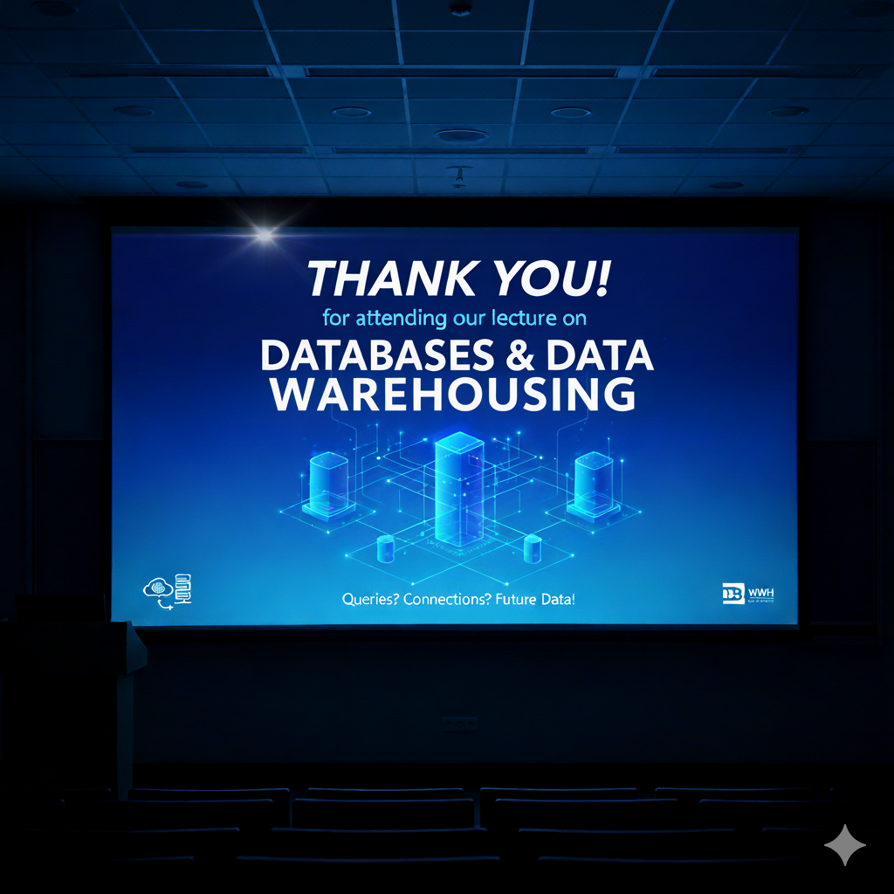

# Epilog

Dieser letzte Foliensatz umfasst die folgenden Abschnitte:

1. Zusammenfassung
1. Ausblick
1. Dankeschön

---

## Zusammenfassung

***Kapitel 1:* Datenstrukturen und Algorithmen**

***Kapitel 2:* Datenbanken und Anfragesprachen**

***Kapitel 3:* Datenlager und Analysetechniken**

---

### Kapitel 1: Datenstrukturen und Algorithmen

**Liste**

*Lineare* Verkettung

**Graphen**

*Beliebige* Verknüpfung

**Bäume**

*Hierarchische* Anordnung

---

### Kapitel 2: Datenbanken und Anfragesprachen

**ER-Modelle**

*Grafische Darstellung*

**Relationale Datenbanken**

*Technische Umsetzung*

**SQL**

*Funktionale Anforderung*

---

### Kapitel 3: Datenlager und Analysetechniken

**Datenlager-Schemata**

*Datenstrukturierung*

**Extract-Transform-Load**

*Datenbereitstellung*

**OLAP**

*Datenverarbeitung*

---

## Ausblick

Weitere *Aufgabenstellungen*, die über das hier vorgestellte hinausgehen:

- **Ausreißer-Erkennung** - Erkennen von ungewöhnlichen Abweichungen
- **Clusteranalyse** - Gruppierung von ähnlichen Datensätzen
- **Kassifikation** - Zuordnung von Datensätzen und Klassen
- **Assoziationsanalyse** - Ableitung von Abhängigkeiten zwischen Datensätzen
- **Regressionsanalyse** - Bestimmung von Zusammenhängen zwischen Variablen
- **Zusammenfassung** - Reduzierung von Datensätzen auf Wesentliches

*Dafür gibt es **fortgeschrittene Methoden** aus dem Fachgebiet des **Data Mining**!*

---

## **Dankeschön** für Ihre Teilnahme an diesem Kurs!

**Wir freuen uns über Feedback und hoffen, Sie können das erworbene Wissen in Zukunft gut gebrauchen.**

*GH*