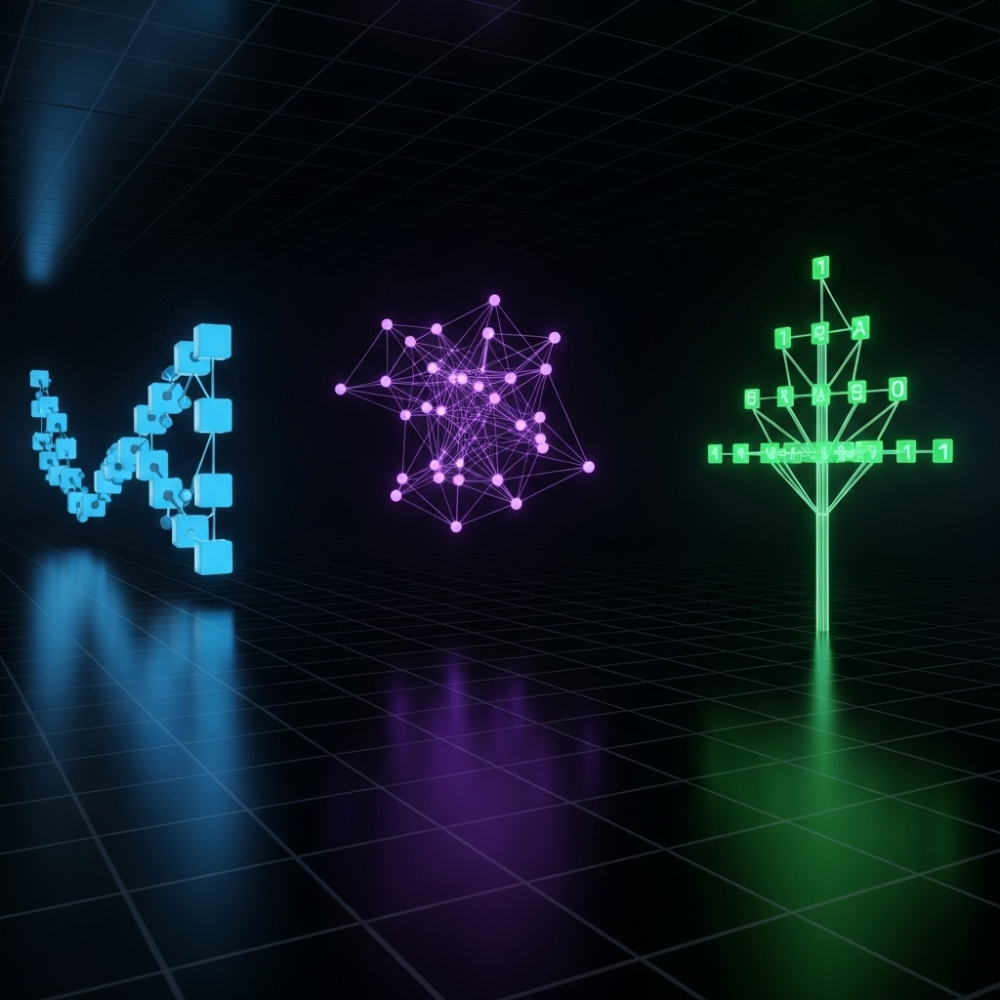

# Kapitel 1: Datenstrukturen
Dieses erste Kapitel umfasst die folgenden drei Abschnitte:

1. Listen
1. Graphen
1. Bäume

---


## Listen

Geordnete (d.h. nummerierte) Sammlung von Elementen eines gegebenen Datentyps:

- Nachrichten im Eingang des eigenen Postfachs
- Adressen von Kontakten in einer Kontaktdatenbank
- Posten mit Stückzahlen und Preisen einer Rechnung

---

### Konzeptualisierung

Im Folgenden benötigen wir einige Begriffe, um über Listen sprechen zu können. Unsere Konzeptualisierung umfasst die folgenden Begriffe:

- *Listenelement* - Eintrag in einer Liste mit seinen zugehörigen Informationen (z.B. Name des Kontakts oder Preis des Rechnungspostens)
- *Listenindex* - Eindeutige Nummer des Eintrags einer Liste, über die auf den Eintrag zugegriffen werden kann
- *Listenkopf* - Erster Eintrag einer Liste (d.h. der Eintrag mit der Nummer 1 bzw. 0 in Rechnersystemen)
- *Listenlänge* - Anzahl der Einträge in einer Liste (hast den Wert 0, wenn die Liste keine Einträge hat!)

---

### Formalisierung

Listen können basiertend auf der Menge der Datenelemente $D$ und der Menge der natürlichen Zahlen $\mathbb{N}$ (ohne Null) als **Folgen** oder **Sequenzen** formalisiert werden:

- Die Menge der **endlichen Sequenzen definierter Länge** $n \in \mathbb{N}$ über $D$ ist definiert als $D^n = \{ \{i \in \mathbb{N}: i \leq n\} \rightarrow D \}$
- Die Menge der **endlichen Sequenzen beliebiger Länge** über $D$ ist definiert als $D^\# = \bigcup_{n \in \mathbb{N}} D^n$
- Die Menge der **endlichen Listen beliebiger Länge** über $D$ ist definiert als $l(D) = \{(n, S) \in \mathbb{N} \times E^* | S \in E^n\}$
  - *Listen merken sich in diesem Formalismus explizit ihre Länge, während Sequenzen diese Information nicht mit sich tragen*

---

<div class="columns">
<div class="three">

### Programmierschnittstelle

Und so sieht die Programmierschnittstelle in C# aus:

```csharp
class List<T> {
    private Element<T> head = null;
    public int length() { ... }
    public T get(int index) { ... }
    public T remove(int index) { ... }
    public void append(T element) { ... }
    public void prepend(T element) { ... }
    public void replace(int index, T element) { ... }
    public boolean contains(T element) { ... }
}

class Element<T> {
    public T value;
    public Element<T> next;
}
```

</div>
<div>


</div>
</div>

---

### Anwendungsbeispiel

```csharp
// Erzeuge eine neue Listenstruktur
List<string> list = new List();

// Füge der Listenstruktur Elemente hinzu
list.append("A");
list.append("B");

// Berechne die Länge der Liste und gib den Wert auf der Konsole aus
Console.WriteLine(list.length());

// Lösche das erste Element aus der Liste
list.remove(0);

// Ersetze das erste Element der Liste
list.replace(0, "C");
```

---

<div class="columns">
<div class="four">

### Implementierung der Methode `length()`

```csharp
public int length() {
    // Iterator mit dem Listenkopf initialisieren
    Element<T> iterator = head;
    // Zähler mit dem Wert Null initialisieren
    int counter = 0;
    // Solange iterieren, bis Listenende erreicht ist
    while (iterator != null) {
        // Iterator auf das nächste Listenelement setzen
        iterator = iterator.next;
        // Zähler um den Wert Eins erhöhen
        counter++;
    }
    // Wert des Zählers zurückgeben
    return counter;
}
```

</div>
<div>


</div>
</div>

---

### Implementierung der Methode `get(...)`

```csharp
public T get(int index) {
    // Iterator mit dem Listenkopf initialisieren
    Element<T> iterator = head;
    // Solange iterieren, bis gewünschtes Listenelement oder Listenende erreicht ist
    while (index > 0 && iterator != null) {
        // Iterator auf das nächste Listenelement setzen
        iterator = iterator.next;
        // Index um den Wert eins reduzieren
        index--;
    }
    // Wenn Index nicht gültig war, eine Ausnahme werfen
    if (iterator == null) {
        throw new Exception("Index out of bounds.");
    }
    // Wert des aktuellen Listenelements zurückgeben
    return iterator.value;
}
```

---

### Implementierung der Methode `remove(...)`

```csharp
public T remove(int index) {
    // Prüfe, ob Listenkopf entfernt werden soll oder nicht
    if (index == 0) {
        // Wenn Liste leer ist, werfe eine Ausnahme
        if (head == null) {
            throw new Exception("Index out of bounds.")
        }
        // Merke den aktuellen Listenkopf
        Element<T> temp = head;
        // Setze den Listenkopf auf das zweite Listenelement
        head = head.next;
        // Gebe den Wert des ursprünglichen Listenkopfs zurück
        return temp.value;
    } else {
        // (siehe nächste Folie!)
    }
}
```

---

### Implementierung der Methode `remove(...)` (cont'd)

```csharp
public T remove(int index) {
    // Prüfe, ob Listenkopf entfernt werden soll oder nicht
    if (index == 0) {
        // (siehe vorige Folie!)
    } else {
        // Bestimme das vorangehende Listenelement
        Element<T> prev = get(index - 1);
        // Bestimme das zu entfernende Listenelement
        Element<T> temp = prev.next;
        // Aktualisiere den Nachfolger des Vorgängers
        prev.next = temp.next;
        // Gib den Wert des zu entfernenden Listenelements zurück
        return temp.value;
    }
}
```

---

### Implementierung der Methode `contains(...)`

```csharp
public boolean contains(T element) {
    // Iterator mit dem Listenkopf initialisieren
    Element<T> iterator = head;
    // Prüfen, ob Listenende erreicht wurde
    while (iterator != null) {
        // Prüfen, ob der aktuelle Listeniterator den gesuchten Wert hat
        if (iterator.value == element) {
            // Falls ja, wahr zurückgeben
            return true
        }
        // Den Iterator auf das nächste Listenelement setzen
        iterator = iterator.next;
    }
    // Der gewünschte Wert wurde nicht gefunden, also falsch zurückgeben
    return false;
}
```

---


### Geschachtelte Listen

Die Elemente einer Liste können wiederum Listen sein, sodass eine Schachtelung entsteht:

- Eine einfache Schaltelung ergibt eine zweidimensionale Datenstruktur
- Eine zweifache Schachtelung ergibt eine dreidimensionale Datenstruktur

---

### Anwendungsbeispiel

```csharp
// Erzeuge eine Liste von Listen
List<List<string>> list = new List();

// Füge der Liste zwei Unterlisten hinzu
list.append(new List<string>());
list.append(new List<string>());

// Füge der ersten Unterliste zwei Element hinzu
list.get(0).append("A");
list.get(0).append("B");

// Gib das erste und zweite Element der ersten Unterliste auf der Konsole aus
Console.WriteLine(list.get(0).get(0));
Console.WriteLine(list.get(0).get(1));

// Berechne die Länge der zweiten Unterliste und gib den Wert auf der Konsole aus
Console.WriteLine(list.get(1).length());
```

---


## Graphen

Strukturen bestehend aus Knoten (die Elemente) und Kanten (die Beziehungen zwischen Elementen):

- Soziale Netzwerke wie LinkedIn oder Instragram
- Verkehrsnetze für Fahrzeuge, Flugzeuge, Schiffe, usw.
- Kommunikationsnetze für Telefon und Internet

---

### Formalisierung

Im Folgenden benötigen wir einen Formalismus, um Graphen und ihre Eigenschaften beschreiben zu können. Unser Formalismus umfasst die folgenden Elemente:

- $V$ ist die Menge der Knoten
  - $v \in V$ ist ein spezieller Knoten
- $E \subseteq V \times V$ ist die Menge der Kanten als Teilmenge des karthesischen Produkts
  - $(u, v) = e \in E$ ist eine spezielle Kante von Knoten $u$ nach Knoten $v$
  - Kanten haben in diesem Formalismum **eine Richtung** und **kein Gewicht**
  - *Es gibt auch Varianten ohne Richtung und mit Gewichtung!*
- $G = (V, E)$ ist der Graph selbst bestehend aus Knoten- und Kantenmenge

---


### Exkurs: Adjazenzmatrix

Die Kantenmenge $E \subseteq V \times V$ kann als sogenannte Adjazenzmatrix $A$ mit Einträgen $A_{i,j}$ dargestellt werden:

- Die **Spalten** $i$ und **Zeilen** $j$ dieser Matrix repräsentieren die Knoten des Graphen
- Die **Zellen** $A_{i,j}$ der Matrix mit den Einträgen $1$ repräsentieren die Kanten des Graphen

---


### Transitive Hülle

Um bestimmen zu können, ob ein Pfad von Knoten $u \in V$ zu Knoten $v \in V$ führt, hilft das Konzept der transitiven Hülle $t(E) \subseteq V \times V$ mit $(u, v) \in t(E)$ genau dann, wenn

- **Fall 1 (direkte Verbindung)** - Es existiert eine Kante $(u, v) \in E$ oder
- **Fall 2 (indirekte Verbindung)** - Es existiert ein Zwischenknoten $w \in V$ mit $(u, w) \in t(E)$ und $(w, v) \in t(E)$

---

<div class="columns">
<div class="two">

### Zyklische und azyklische Graphen

Für manche Berechnungen ist es wichtig zwischen zyklischen und azyklischen Graphen $G = (V, E)$ zu unterscheiden:

- In **azyklischen Graphen** gibt es *keinen* Pfad von einem Knoten zu sich selbst, das heißt es gilt $\forall (u, v) \in t(E) : u \neq v$
- Für **zyklische Graphen** gibt es mindestens einen Pfad von einem Knoten zu sich selbst, das heißt es gilt $\exists (u, v) \in t(E) : u = v$

</div>
<div>


</div>
</div>

---

<div class="columns">
<div class="two">

### Programmierschnittstelle

Und so sieht eine mögliche Umsetzung in C# aus:

```csharp
class Graph<T> {
    private List<Node<T>> nodes;

    public Node<T> addNode(T value) { ... }
    public void removeNode(Node<T> node) { ... }

    public boolean hasEdge(Node<T> source, Node<T> target) { ... }
    public void addEdge(Node<T> source, Node<T> target) { ... }
    public void removeEdge(Node<T> source, Node<T> target) { ... }

    public boolean hasPath(Node<T> source, Node<T> target) { ... }
}

class Node<T> {
    public T value;
    public List<Node<T>> edges;
}
```

</div>
<div>


</div>
</div>

---

<div class="columns">
<div class="two">

### Anwendungsbeispiel

```csharp
// Erstelle eine neue Graphenstruktur
Graph<string> graph = new Graph();

// Füge dem Graphen seine Knoten hinzu
var a = graph.addNode("A");
var b = graph.addNode("B");
var c = graph.addNode("C");

// Füge dem Graphen seine Kanten hinzu
graph.addEdge(a, b);
graph.addEdge(b, c);

// Prüfe, ob eine Kante zwischen zweo Knoten existiert
Console.WriteLine(graph.hasEdge(a, c));

// Prüfe, ob ein Pfad zwischen zwei Knoten existiert
Console.WriteLine(graph.hasPath(a, c));
```

</div>
<div>


</div>
</div>

---

### Implementierung der Methode `addNode(...)`

Und so könnte die Methode aussehen, die dafür verantwortlich ist, neue Knoten in die Graphenstruktur einzufügen:

```csharp
public Node<T> addNode(T value) {

    // Neues Knotenobjekt erzeugen
    Node<T> node = new Node();
    // Wert des Knoteobjektes initialisieren
    node.value = value;
    // Knotenobjekt in die Knotenliste aufnehmen
    nodes.append(node);
    // Knotenobjekt zurückgeben
    return node;

}
````

---

### Implementierung der Methode `hasEdge(...)`

Bevor wir eine Verbindung zwischen zwei Knoten hinzufügen, sollten wir prüfen, ob die Kante bereits exisiert:

```csharp
public void hasEdge(Node<T> source, Node<T> target) {
    // Durchlaufe alle Nachbarknoten
    foreach (Node<T> neighbor in source.neighbors) {
        // Prüfe, ob der Nachbarknoten der Zielknoten ist
        if (neighbor == target) {
            // Wenn ja, geben wahr zurück
            return true;
        }
    }
    // Wenn der Zielknoten nicht gefunden wurde, gebe falsch zurück
    return false;
}
```

---

### Implementierung der Methode `addEdge(...)`

Nun können wir auf Basis der vorigen Methoden die Methode für das Hinzufügen von neuen Kanten definieren:

```csharp
public void addEdge(Node<T> source, Node<T> target) {
    // Prüfen, ob die Kante bereits erstellt wurde
    if (hasEdge(source, target)) {
        // Falls ja, eine Ausnahme werfen
        throw new Exception("Edge already exists!");
    }
    // Ansonsten den Zielknoten in die Liste der Nachbarknoten eintragen
    source.neighbors.append(target);
}
```

---

### Implementierung der Methode `hasPath(...)` für **azyklische Graphen**

```csharp
public boolean hasPath(Node<T> source, Node<T> target) {
    // Prüfe, ob eine direkte Verbindung (d.h. eine Kante) existert
    if (hasEdge(source, target)) {
        // Wenn ja, gib wahr zurück
        return true
    }
    // Prüfe, ob einer der Nachbarknoten eine Pfad zum Zielknoten hat
    foreach (Node<T> neighbor in source.neighbors) {
        // Führe die Pfadsuche rekursiv durch (Vorsicht bei zyklischen Graphen!)
        if (hasPath(neighbor, target)) {
            // Falls ein Pfad gefunden wurde, gib wahr zurück
            return true
        }
    }
    // Fall weder ein direkter noch ein indirekter Pfad gefunden wurde, gib falsch zurück
    return false
}
```

---

<div class="columns">
<div class="two">

### Problem bei **zyklischen Graphen**

Im rechten Beispiel würde der Aufruf der naiven Implementierung von `hasPath(A, D)` zu folgender Endlosrekursion führen:

- **`hasPath(A, D)`** führt zu:
    - `hasPath(B, D)` führt zu:
      - **`hasPath(A, D)`** führt zu:
        - `hasPath(B, D)` führt zu:
          - ...
      - *`hasPath(C, D)` wird nie erreicht!*

</div>
<div>


</div>
</div>

---

### Implementierung der Methode `hasPath(...)` für **zyklische Graphen**

```csharp
public boolean hasPath(Node<T> source, Node<T> target, List<Node<T>> visited = new List<T>()) {
    // Prüfe, ob eine direkte Verbindung (d.h. eine Kante) existert
    if (hasEdge(source, target)) {
        // Wenn ja, gib wahr zurück
        return true
    }
    // Markiere den Quellknoten als besucht (damit er in einem rekursiven Aufruf nicht noch einmal besucht wird)
    visited.append(source);
    // Prüfe, ob einer der Nachbarknoten eine Pfad zum Zielknoten hat
    foreach (Node<T> neighbor in source.neighbors) {
        // Prüfe, ob der Nachbarknoten bereits in einem vorigen Rekursionsschritt besucht wurde
        if (!visited.contains(source)) {
            // Führe die Pfadsuche rekursiv durch und übergebe die Liste der besuchten Knoten
            if (hasPath(neighbor, target, visited)) {
                // Falls ein Pfad gefunden wurde, gib wahr zurück
                return true
            }
        }
    }
    // Fall weder ein direkter noch ein indirekter Pfad gefunden wurde, gib falsch zurück
    return false
}
```

---

<div class="columns">
<div class="two">

### Illustration der Lösung

Hier wieder der Rekursionsbaum für den Aufruf der Methode `hasPath(A, B)`:

- `hasPath(A, D, [])` führt zu:
  - `hasPath(B, D, [A])` führt zu:
    - *`hasPath(A, D, [A, B])` wird **nicht** ausgeführt, da Knoten `A` bereits besucht!*
    - `hasPath(C, D, [A, B])` wird hingegen als nächstes ausgeführt und liefert den Wert `true`, da eine direkte Verbindung zwischen Knoten `C` und `D` besteht

</div>
<div>


</div>
</div>

---


## Bäume

TODO
