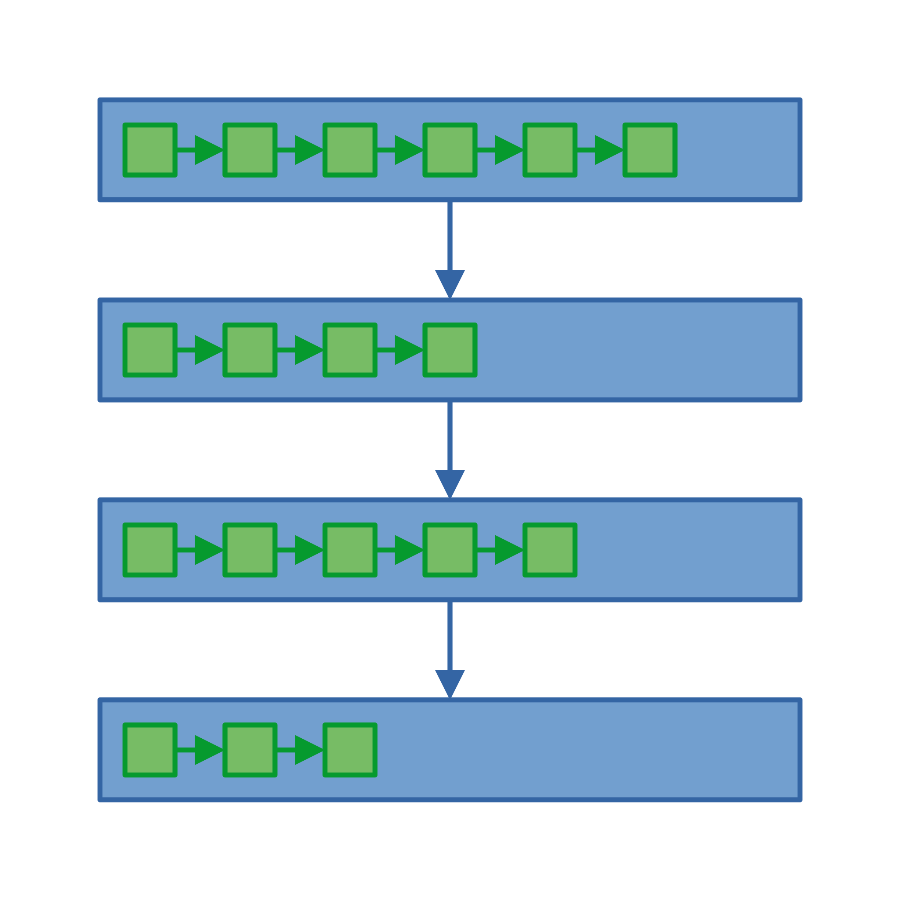

# Kapitel 1: Datenstrukturen

Dieses erste Kapitel umfasst die folgenden drei Abschnitte:

1. Listen
1. Graphen
1. Bäume

---


## Listen

Geordnete (d.h. nummerierte) Sammlung von Elementen eines gegebenen Datentyps:

- Listenelement (Element der Liste an einer beliebigen Stelle)
- Listenkopf und -ende (Erstes und letztes Element der Liste)
- Varianten (Einfach und doppelt verkettete Liste)

---

<div class="columns">
<div class="three">

### Programmierschnittstelle

Und so sieht die Programmierschnittstelle in C# aus:

```csharp
class List<T> {
    private Element<T> head = null;
    public int length() { ... }
    public T get(int index) { ... }
    public T remove(int index) { ... }
    public void append(T element) { ... }
    public void prepend(T element) { ... }
    public void replace(int index, T element) { ... }
}

class Element<T> {
    public T value;
    public Element<T> next;
}
```

</div>
<div>


</div>
</div>

---

<div class="columns">
<div class="four">

### Implementierung der Methode `length()`

```csharp
public int length() {
    // Iterator mit dem Listenkopf initialisieren
    Element<T> iterator = head;
    // Zähler mit dem Wert Null initialisieren
    int counter = 0;
    // Solange iterieren, bis Listenende erreicht ist
    while (iterator != null) {
        // Iterator auf das nächste Listenelement setzen
        iterator = iterator.next;
        // Zähler um den Wert Eins erhöhen
        counter++;
    }
    // Wert des Zählers zurückgeben
    return counter;
}
```

</div>
<div>


</div>
</div>

---

### Implementierung der Methode `get(...)`

```csharp
public T get(int index) {
    // Iterator mit dem Listenkopf initialisieren
    Element<T> iterator = head;
    // Solange iterieren, bis gewünschtes Listenelement oder Listenende erreicht ist
    while (index > 0 && iterator != null) {
        // Iterator auf das nächste Listenelement setzen
        iterator = iterator.next;
        // Index um den Wert eins reduzieren
        index--;
    }
    // Wenn Index nicht gültig war, eine Ausnahme werfen
    if (iterator == null) {
        throw new Exception("Index out of bounds.");
    }
    // Wert des aktuellen Listenelements zurückgeben
    return iterator.value;
}
```

---

### Implementierung der Methode `remove(...)`

```csharp
public T remove(int index) {
    // Prüfe, ob Listenkopf entfernt werden soll oder nicht
    if (index == 0) {
        // Wenn Liste leer ist, werfe eine Ausnahme
        if (head == null) {
            throw new Exception("Index out of bounds.")
        }
        // Merke den aktuellen Listenkopf
        Element<T> temp = head;
        // Setze den Listenkopf auf das zweite Listenelement
        head = head.next;
        // Gebe den Wert des ursprünglichen Listenkopfs zurück
        return temp.value;
    } else {
        // (siehe nächste Folie!)
    }
}
```

---

### Implementierung der Methode `remove(...)` (cont'd)

```csharp
public T remove(int index) {
    // Prüfe, ob Listenkopf entfernt werden soll oder nicht
    if (index == 0) {
        // (siehe vorige Folie!)
    } else {
        // Bestimme das vorangehende Listenelement
        Element<T> prev = get(index - 1);
        // Bestimme das zu entfernende Listenelement
        Element<T> temp = prev.next;
        // Aktualisiere den Nachfolger des Vorgängers
        prev.next = temp.next;
        // Gib den Wert des zu entfernenden Listenelements zurück
        return temp.value;
    }
}
```

---



### Geschachtelte Listen

Die Elemente einer Liste können wiederum Listen sein, sodass eine Schachtelung entsteht:

- Eine einfache Schaltelung ergibt eine zweidimensionale Datenstruktur
- Eine zweifache Schachtelung ergibt eine dreidimensionale Datenstruktur

---


## Graphen

TODO

---


## Bäume

TODO
