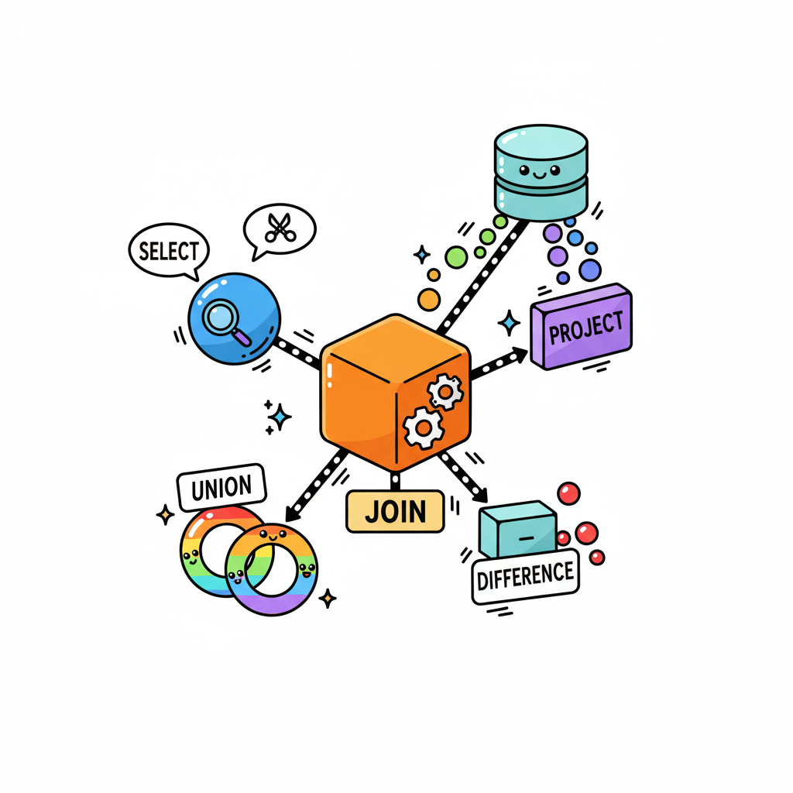

# Kapitel 2: Datenbanken und Anfragesprachen

Dieses zweite Kapitel umfasst die folgenden Abschnitte:

1. Entity-Relationship-Modelle
1. Relationale Datenbanksysteme
1. Structured Query Language

---


## Entity-Relationship-Modelle

Grafische Beschreibung der relevanten Datenstrukturen einer Anwendungsdomäne:

- Hochschulen mit Studierenden, Lektoren und Kursen
- Betriebe mit Mitarbeitern, Projekten und Arbeitspaketen
- Banken mit Kunden, Konten und Transaktionen

---

### Konzepte

Entity-Relationship-Modelle umfassen die folgenden drei Konzepte für die Beschreibung der Datenstrukturen:

- **Entitäten** - Eindeutig identifizierbare Objekte einer Anwendungsdomäne wie der Kunde oder der Kurs
- **Attribute** - Eigenschaften der Objekte wie der der Name eines Kunden oder die Dauer eines Projekts
- **Beziehungen** - Die Verknüpfungen zwischen den Objekten wie die Zuweisung von Lektoren zu Kursen
- **Kardinalitäten** - Die Häufigkeit von Verknüpfungen (ein Kurs hat genau einen Lektor, ein Projekt hat mehrere Mitarbeiter)

---


### Attribute und Bedingungen

Des Weiteren können Bedingungen an Attribute geknüpft werden:

- **Primärschlüssel** - Das Attribut identifiziert die zugehörige Entität eindeutig (z.B. Matrikel-nummer eines/einer Student*in)
- **Eindeutigkeit** - Jede Entität hat für das Attribut einen anderen Wert (z.B. E-Mail-Adresse eines/ einer Student*in)

---

### Beziehungen und Kardinalitäten

Des Weiteren kann man anhand der Kardinalitäten (`1` oder `m` bzw. `n`) mehrere Arten von Beziehungen zwischen zwei Entitäten `A` und `B` unterscheiden:

- **`1`-zu-`1` Beziehung** - Jede Entität `A` ist mit genau einer Entität `B` verknüpft und umgekehrt
  - z.B. *Studen\*innen* und seine/ihre *Prüfungsergebnisse*
- **`1`-zu-`n` Beziehung** - Jede Entität `A` ist potenziell mit mehreren Entitäten `B` verknüpft, jede Entität `B` aber nur mit genau einer Entität `A`
  - z.B. *Lektor\*innen* und seine/ihre *Lehrveranstaltungen*
- **`m`-zu-`n` Beziehung** - Jede Entität `A` ist potenziell mit mehreren Entitäten `B` verknüpft und umgekert
  - z.B. *Studiengänge* und ihr *Lehrverstaltungen*

---

<div class="columns">
<div class="two">

### Grundlegende grafische Notation

Das Beispiel auf der rechten Seite zeigt die grafische Notation von Entity-Relationship-Modellen:

- Die **Kästen** repräsentieren die Entitäten der Anwendungsdomäne und deren Attribute
  - Die Attribute sind in den Kästen in **Tabellenform** dargestellt
- Die **Verbindungslinien** repräsentieren die Relationen und deren Kardinalitäten
  - Die Kardinalitäten sind durch Symbole an den **Linienenden** dargestellt

</div>
<div>



</div>
</div>

---

<div class="columns">
<div class="two">

### Grafische Notation der verschiedenen Kardinalitäten einer Beziehung

Die Beziehungen im Diagramm auf der rechten Seite sind wie folgt zu lesen:

- Jedes `A` hat genau ein `B`
- Jedes `B` hat maximal ein `A`
- Jedes `C` hat mindestens ein `D`
- Jedes `D` hat beliebig viele `C`

Die Darstellung definiert somit immer eine untere (`0` oder `1`) und eine obere (`1` oder `n`) Grenze.

</div>
<div>



</div>
</div>

---

<div class="columns">
<div class="three">

### Darstellung von Bedingungen für Attribute

In der erweiterten grafischen Notation sind auch die Bedingungen für die Attribute enthalten:

- `PK` steht für eine Primärschlüssel-Bedingung (Englisch *primary key*)
  - z.B.Name des Studiengangs und Matrikelnummer des Teilnehmers
- `UK` steht für Eindeutigkeits-Bedingung (Englisch *uniqueness key*)
  - z.B. E-Mail-Adresse Teilnehmers

</div>
<div>


</div>
</div>

---

<div class="columns">
<div>

### Darstellung von Kommentaren

Schließlich kann die Darstellung von Entity-Relationship-Modellen noch um Kommentare erweitert werden:

- Kommentare werden als zusätzliche Spalte in der Attributtabelle einer Entität dargestellt
- Kommentare sind somit für die detailliertere Beschreibung von Attributen gedacht

</div>
<div>



</div>
</div>

---

<div class="columns">
<div>

### Vererbung in der Programmierung

Aus der objektorientierten Programmierung kennen wir bereits das Prinzip der Vererbung:

- Elternklasse mit Gemeinsamkeiten und Kindklassen mit Spezifika
- Zum Beispiel haben sowohl Lektoren als auch Kursteilnehmer*innen einen Vornamen und einen Nachnamen
- Jedoch haben nur Lektoren eine Personalnummer

</div>
<div>

```csharp
class Person {
  string Vorname;
  string Nachname;
  string Email;
}

class Lektor : Person {
  string Personalnummer;
}

class Teilnehmer : Person {
  string Materialnummer;
}
```

</div>
</div>

---

<div class="columns">
<div>

### Abbildung von Vererbung in Entity-Relationship-Modellen

Prinzipien der Abbildung:

- **Elternentität** mit ID- und Typattribut sowie weiteren gemeinsamen Attributen, **Kindentitäten** mit ID-Attribut und spezifischen Attributen
- **`ist ein`-Beziehungen** (Kardinalität der *Elternentität* ist `genau 1`, Kardinalität der *Kindentität* ist `maximal 1`)


</div>
<div>



</div>
</div>

---


### Aufgaben für das **Selbststudium**

So kannst du dein Verständnis noch weiter vertiefen:

- Erstelle ein Entity-Relationship-Modell für einen produzierenden Betrieb
- Erstelle ein Entity-Relationship-Modell für eine Social Media Plattform

---


## Relationale Datenbanksysteme

TODO

---

### Relationale Algebra

TODO

---



### Relationale Operationen

Die relationale Algebra umfasst die folgenden Operationen:

- Vereinigung, Schnittmenge, Differenz, Symmetrische Differenz, Kartesisches Produkt
- Projektion und Selektion
- Join, Equi-Join, Natural Join, Outer Join, Anti Join
- Umbenennung und Division

---

### Vereingung

TODO

---

### Schnittmenge

TODO

---

### Differenz

TODO

---

### Symmetrische Differenz

TODO

---

### Kartesisches Produkt

TODO

---

### Projektion

TODO

---

### Selektion

TODO

---

### Join

TODO

---

### Umbenennung

TODO

---

### Division

TODO

---


### Aufgaben für das **Selbststudium**

So kannst du dein Verständnis noch weiter vertiefen:

- TODO

---


## Structured Query Language

TODO

---


### Aufgaben für das **Selbststudium**

So kannst du dein Verständnis noch weiter vertiefen:

- TODO