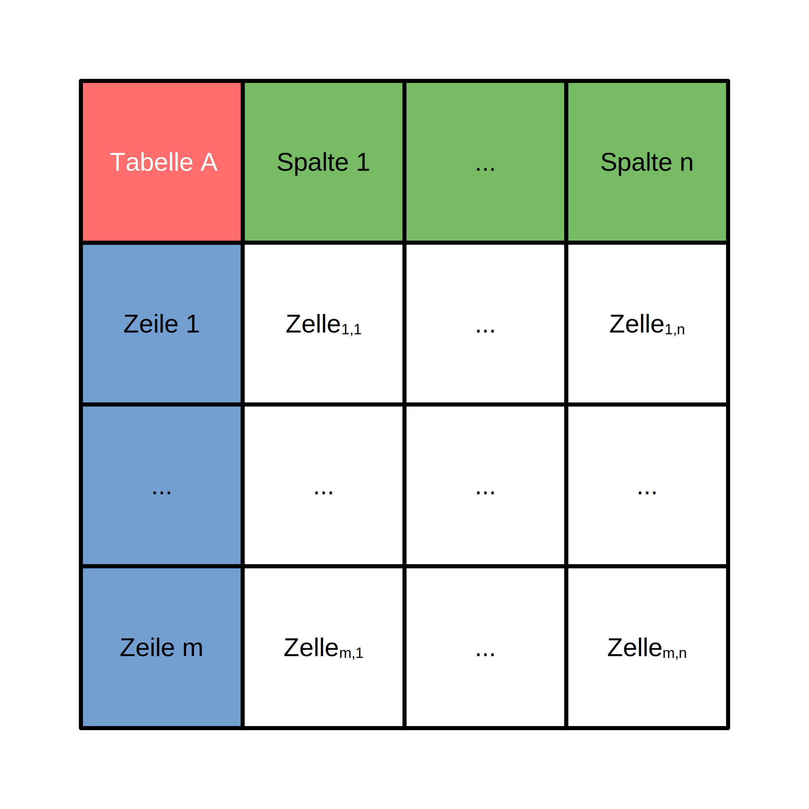

# Kapitel 2: Datenbanken und Anfragesprachen

Dieses zweite Kapitel umfasst die folgenden Abschnitte:

1. Entity-Relationship-Modelle
1. Relationale Datenbanksysteme
1. Structured Query Language

---


## Entity-Relationship-Modelle

Grafische Beschreibung der relevanten Datenstrukturen einer Anwendungsdomäne:

- Hochschulen mit Studierenden, Lektoren und Kursen
- Betriebe mit Mitarbeitern, Projekten und Arbeitspaketen
- Banken mit Kunden, Konten und Transaktionen

---

### Konzepte

Entity-Relationship-Modelle umfassen die folgenden drei Konzepte für die Beschreibung der Datenstrukturen:

- **Entitäten** - Eindeutig identifizierbare Objekte einer Anwendungsdomäne wie der Kunde oder der Kurs
- **Attribute** - Eigenschaften der Objekte wie der der Name eines Kunden oder die Dauer eines Projekts
- **Beziehungen** - Die Verknüpfungen zwischen den Objekten wie die Zuweisung von Lektoren zu Kursen
- **Kardinalitäten** - Die Häufigkeit von Verknüpfungen (ein Kurs hat genau einen Lektor, ein Projekt hat mehrere Mitarbeiter)

---


### Attribute und Bedingungen

Des Weiteren können Bedingungen an Attribute geknüpft werden:

- **Primärschlüssel** - Das Attribut identifiziert die zugehörige Entität eindeutig (z.B. Matrikel-nummer eines/einer Student*in)
- **Eindeutigkeit** - Jede Entität hat für das Attribut einen anderen Wert (z.B. E-Mail-Adresse eines/ einer Student*in)

---


### Zusammengesetzte Primärschlüssel

Auch eine Kombination mehrerer Attribute kann eine Entität eindeutig identifizieren:

- Längen- und Breitengrad identifiziert einen Ort auf dem Globus eindeutig
- Land, Ortschaft, Straße, Hausnummer identifiziert eine Postanschrift eindeutig
- Fluglinie, Quell- und Zielflughafen, sowie Abflugdatum und -uhrzeit identifizieren einen Flug eindeutig

---

### Beziehungen und Kardinalitäten

Des Weiteren kann man anhand der Kardinalitäten (`1` oder `m` bzw. `n`) mehrere Arten von Beziehungen zwischen zwei Entitäten `A` und `B` unterscheiden:

- **`1`-zu-`1` Beziehung** - Jede Entität `A` ist mit genau einer Entität `B` verknüpft und umgekehrt
  - z.B. *Studen\*innen* und seine/ihre *Prüfungsergebnisse*
- **`1`-zu-`n` Beziehung** - Jede Entität `A` ist potenziell mit mehreren Entitäten `B` verknüpft, jede Entität `B` aber nur mit genau einer Entität `A`
  - z.B. *Lektor\*innen* und seine/ihre *Lehrveranstaltungen*
- **`m`-zu-`n` Beziehung** - Jede Entität `A` ist potenziell mit mehreren Entitäten `B` verknüpft und umgekert
  - z.B. *Studiengänge* und ihr *Lehrverstaltungen*

---

<div class="columns">
<div class="two">

### Grundlegende grafische Notation

Das Beispiel auf der rechten Seite zeigt die grafische Notation von Entity-Relationship-Modellen:

- Die **Kästen** repräsentieren die Entitäten der Anwendungsdomäne und deren Attribute
  - Die Attribute sind in den Kästen in **Tabellenform** dargestellt
- Die **Verbindungslinien** repräsentieren die Relationen und deren Kardinalitäten
  - Die Kardinalitäten sind durch Symbole an den **Linienenden** dargestellt

</div>
<div>


</div>
</div>

---

<div class="columns">
<div class="two">

### Grafische Notation der verschiedenen Kardinalitäten einer Beziehung

Die Beziehungen im Diagramm auf der rechten Seite sind wie folgt zu lesen:

- Jedes `A` hat genau ein `B`
- Jedes `B` hat maximal ein `A`
- Jedes `C` hat mindestens ein `D`
- Jedes `D` hat beliebig viele `C`

Die Darstellung definiert somit immer eine untere (`0` oder `1`) und eine obere (`1` oder `n`) Grenze.

</div>
<div>


</div>
</div>

---

<div class="columns">
<div class="three">

### Darstellung von Bedingungen für Attribute

In der erweiterten grafischen Notation sind auch die Bedingungen für die Attribute enthalten:

- `PK` steht für eine Primärschlüssel-Bedingung (Englisch *primary key*)
  - z.B.Name des Studiengangs und Matrikelnummer des Teilnehmers
- `UK` steht für Eindeutigkeits-Bedingung (Englisch *uniqueness key*)
  - z.B. E-Mail-Adresse Teilnehmers

</div>
<div>


</div>
</div>

---

<div class="columns">
<div>

### Darstellung von Kommentaren

Schließlich kann die Darstellung von Entity-Relationship-Modellen noch um Kommentare erweitert werden:

- Kommentare werden als zusätzliche Spalte in der Attributtabelle einer Entität dargestellt
- Kommentare sind somit für die detailliertere Beschreibung von Attributen gedacht

</div>
<div>


</div>
</div>

---

<div class="columns">
<div>

### Vererbung in der Programmierung

Aus der objektorientierten Programmierung kennen wir bereits das Prinzip der Vererbung:

- Elternklasse mit Gemeinsamkeiten und Kindklassen mit Spezifika
- Zum Beispiel haben sowohl Lektoren als auch Kursteilnehmer*innen einen Vornamen und einen Nachnamen
- Jedoch haben nur Lektoren eine Personalnummer

</div>
<div>

```csharp
class Person {
  string Vorname;
  string Nachname;
  string Email;
}

class Lektor : Person {
  string Personalnummer;
}

class Teilnehmer : Person {
  string Materialnummer;
}
```

</div>
</div>

---

<div class="columns">
<div>

### Abbildung von Vererbung in Entity-Relationship-Modellen

Prinzipien der Abbildung:

- **Elternentität** mit ID- und Typattribut sowie weiteren gemeinsamen Attributen, **Kindentitäten** mit ID-Attribut und spezifischen Attributen
- **`ist ein`-Beziehungen** (Kardinalität der *Elternentität* ist `genau 1`, Kardinalität der *Kindentität* ist `maximal 1`)


</div>
<div>


</div>
</div>

---


### Aufgaben für das **Selbststudium**

So kannst du dein Verständnis noch weiter vertiefen:

- Erstelle ein Entity-Relationship-Modell für einen produzierenden Betrieb
- Erstelle ein Entity-Relationship-Modell für eine Social Media Plattform

---


## Relationale Datenbanksysteme

Speicherung von Daten in Form von Tabellen und Zugriff über lesende und schreibende Transaktionen:

1. Theorie: Relationale Algebra (Codd 1970)
1. Prototypische Implementierung: System R (IBM 1974)
1. Kommerzialisierung: Oracle (Relational Software 1979)

---

### Relationale Algebra (Edgar Codd, 1970)

Relationale Datenbanksysteme betrachten Datensätze als Tupel einer Relation, welche wiederum eine Teilmenge des kartesischen Produktes der Attributdomänen ist: 

- Domänen $D_i$ mit $n \in \mathbb{N}$ und $i \in \mathbb{N}$ entsprechen den Datentypen der Attribute einer Entität (z.B. `boolean`, `int` oder `string`)
- Relationen $R \subseteq D_1 \times ... \times D_n = \bigtimes_{i \leq n} D_i$ mit $n \in \mathbb{N}$ entsprechen den gesammelten Datensätzen (z.B. E-Mail-Kontakte)
- Tupel $t = (t_1, ..., t_n) \in R$ mit $n \in \mathbb{N}$ entsprechen einzelnen Datensätzen, die in einer Relation enthalten sind (z.B. E-Mail-Kontakt `X`)
- Variablen $t_i \in D_i$ entsprechen den Attributwerten der Tupel $(t_1, ..., t_n) \subseteq R$ mit $i \leq n$ und $i,n \in \mathbb{N}$ sowie Domänen $D_i$

---



### Analogie mit Excel

Hier ist eine einfache Analogie für die Konzepte der relationalen Algebra:

- **Relationen** entsprichen zweidimensionalen Tabellen wie z.B. aus Excel bekannt
- **Domänen** entsprechen den Spalten der Tabelle und deren Datentypen
- **Tupel** entsprechen den einzelnen Zeilen der Tabellenstruktur
- **Variablen** entsprechen den Zellen der Tabellenstruktur

---


### Ableitung aus Entity-Relationship-Modell

Entity-Relationship-Modelle können einfach in Relationen überführt werden:

- *Entitäten* des Entity-Relationship-Modells werden zu *Relationen*
- *Attribute* des Entity-Relationship-Modells werden zu *Domänen*
- *Beziehungen* des Entity-Relationship-Modells werden abhängig von den Kardinalitäten zu Domänen für Fremdschlüssel und Hilfsrelationen

---

### Abbildung von Entitäten und Attributen

Das folgende Beispiel zeigt, wie Entitäten und deren Attribute auf Relationen und Domänen abgebildet werden:

<div class="columns top">
<div>

**Entität *Person***


</div>
<div class="three">

**Relation *Person* ($P \subseteq D_1 \times D_2 \times D_3 \times D_4$)**

| <ins>ID</ins> ($D_1$) | Vorname ($D_2$) | Nachname ($D_3$) | Email ($D_4$) |
|-|-|-|-|
| 1 | Roman | Froschauer | ...@fh-wels.at |
| 2 | Martin | Jordan | ...@fh-wels.at |
| 3 | Georg | Hackenberg | ...@fh-wels.at |
| ... | ... | ... | ... |

</div>
</div>

---

### Abbildung von `1`-zu-`1` Beziehungen

Zusätzliche *Domänen* für Fremdschlüssel in **beiden** Relationen (oder optional nur einer der beiden Relationen auch möglich):

<div class="columns top">
<div>

**ER-Modell**


</div>
<div>

**Relation *Person***

| <ins>ID</ins> | <ins class="fk">Adresse_ID</ins> | Nachname | ... |
|-|-|-|-|
| 1 | 1 | Müller | ... |
| 2 | 2 | Muster | ... |
| 3 | 3 | Maier | ... |
| ... | ... | ... | ... |

</div>
<div>

**Relation *Adresse***

| <ins>ID</ins> | <ins class="fk">Person_ID</ins> | Ort |... |
|-|-|-|-|
| 1 | 1 | Wels | ... |
| 2 | 2 | Linz | ... |
| 3 | 3 | Steyr | ... |
| ... | ... | ... | ... |

</div>
</div>

---

### Abbildung von `1`-zu-`n` Beziehungen

Zusätzliche *Domänen* für Fremdschlüssel in **nur einer** Relation (welche mit der Kardinalität `n` auftritt):

<div class="columns top">
<div>

**ER-Modell**


</div>
<div>

**Relation *Projekt***

| <ins>ID</ins> | Name | ... |
|-|-|-|
| 1 | Projekt A | ... |
| 2 | Projekt B | ... |
| 3 | Projekt C | ... |
| ... | ... | ... |

</div>
<div>

**Relation *Arbeitspaket***

| <ins>ID</ins> | <ins class="fk">Projekt_ID</ins> | Bezeichung | ... |
|-|-|-|-|
| 1 | 1 | Anforderungsanalyse | ... |
| 2 | 1 | Systementwurf | ... |
| 3 | 1 | Umsetzung | ... |
| ... | ... | ... | ... |

</div>
</div>

---

### Abbildung von `m`-zu-`n` Beziehungen

Zusätzliche *Relation* mit *Domänen* für Fremdschlüssel, die einen zusammengesetzten Primärschlüssel ergeben (plus optional weitere Beziehungsattribute):

<div class="columns top">
<div>

**ER-Modell**


</div>
<div>

**Relation *Projekt***

| <ins>ID</ins> | Name | ... |
|-|-|-|
| 1 | Projekt A | ... |
| 1 | Projekt B | ... |
| 1 | Projekt C | ... |
| ... | ... | ... |

</div>
<div>

**Relation *ProPer***

| <ins class="pfk">Pro_ID</ins> | <ins class="pfk">Per_ID</ins> |
|-|-|
| 1 | 1 |
| 1 | 2 |
| 2 | 3 |
|-|-|


</div>
<div>

**Relation *Person***

| <ins>ID</ins> | Nachname | ... |
|-|-|-|
| 1 | Müller | ... |
| 1 | Muster | ... |
| 1 | Maier | ... |
| ... | ... | ... |

</div>
</div>

---


### Relationale Operationen

Für die Auswertung der Daten gibt es folgende Operationen:

- Projektion und Selektion
- Vereinigung, Schnittmenge, (Symmetrische) Differenz
- Kartesisches Produkt, Join, Equi-Join, Natural Join, Left/Right/Full Outer Join
- Division
- Gruppierung

---

<div class="columns">
<div class="two">

### Projektion

TODO

</div>
<div>


</div>
</div>

---

<div class="columns">
<div class="two">

### Selektion

TODO

</div>
<div>


</div>
</div>

---

<div class="columns">
<div>

### Gruppierung

TODO

</div>
<div>


</div>
</div>

---

<div class="columns">
<div class="two">

### Vereingung

Gegeben seien zwei Relationen $R,S \subseteq D_1 \times ... \times D_n$ mit $n \in \mathbb{N}$. Wir definieren die Vereinigung beider Relationen $R \cup S$ wie folgt:

<div class="box">

$R \cup S = \{ t : t \in R \vee t \in S \}$

</div>

Somit beinhaltet die Vereingung der beiden Relationen sowohl alle Tupel aus $R$, als auch alle Tupel aus $S$ (Duplikate existieren **nicht** doppelt).

</div>
<div>


</div>
</div>

---

<div class="columns">
<div class="two">

### Schnittmenge

Gegeben seien zwei Relationen $R,S \subseteq D_1 \times ... \times D_n$ mit $n \in \mathbb{N}$. Wir definieren die Schnittmenge beider Relationen $R \cap S$ wie folgt:

<div class="box">

$R \cap S = \{ t : t \in R \wedge t \in S \}$

</div>

Somit beinhaltet die Schnittmenge der beiden Relationen alle Tupel aus $R$, die gleichzeitig **auch** in $S$ enthalten sind.

</div>
<div>


</div>
</div>

---

<div class="columns">
<div class="two">

### Differenz

Gegeben seien zwei Relationen $R,S \subseteq D_1 \times ... \times D_n$ mit $n \in \mathbb{N}$. Wir definieren die Differenz beider Relationen $R \setminus S$ wie folgt:

<div class="box">

$R \setminus S = \{ t : t \in R \wedge t \notin S \}$

</div>

Somit beinhaltet die Differenz der beiden Relationen alle Tupel aus $R$, die **nicht** gleichzeitig auch in $S$ enthalten sind.

</div>
<div>


</div>
</div>

---

<div class="columns">
<div class="two">

### Symmetrische Differenz

Gegeben seien zwei Relationen $R,S \subseteq D_1 \times ... \times D_n$ mit $n \in \mathbb{N}$. Wir definieren die symmetrische Differenz beider Relationen $R \triangle S$ wie folgt:

<div class="box">

$R \triangle S = \{ t : (t \in R \wedge t \notin S) \vee (t \notin R \wedge t \in S) \}$
$= \{ t : t \in R \wedge t \notin S \} \cup \{ t: t \notin R \wedge t \in S \}$
$= (R \setminus S) \cup (S \setminus R$)

</div>

Somit beinhaltet die symmetrische Differenz der beiden Relationen alle Tupel aus $R$, die **nicht** gleichzeitig auch in $S$ enthalten sind, sowie alle Tupel aus $S$, die **nicht** gleichzeitig auch in $R$ enthalten sind.

</div>
<div>


</div>
</div>

---

<div class="columns">
<div>

### Kartesisches Produkt

Gegeben seien zwei Relationen $R \subseteq D_1 \times ... \times D_m$ mit $m \in \mathbb{N}$ und $S \subseteq D_{m+1} \times ... \times D_{m + n}$ mit $n \in \mathbb{N}$. Wir definieren das kartesische Produkt beider Relationen $R \times S$ wie folgt:

<div class="box">

$R \times S : \{(t_1, ... , t_m, t_{m+1}, ..., t_{m+n}) :$
$(t_1, ..., t_m) \in R \wedge (t_{m+1}, ..., t_{m + n}) \in S \}$

</div>

Somit wird jedes Tupel aus $R$ mit jedem Tupel aus $S$ kombiniert (Relationenschema können unterschiedlich sein).

</div>
<div>


</div>
</div>

---

<div class="columns">
<div>

### Join

Gegeben seien zwei Relationen $R \subseteq D_1 \times ... \times D_m$ mit $m \in \mathbb{N}$ und $S \subseteq D_{m+1} \times ... \times D_{m + n}$ mit $n \in \mathbb{N}$.

Gegeben sei des Weiteren ein Prädikat $P: D_1 \times ... \times D_{m+n} \rightarrow \mathbb{B}$ als Funktion über den kombinierten Domänen.

Wir definieren den Join beider Relationen mit Prädikat $R \bowtie_P S$ wie folgt:

<div class="box">

$R \bowtie_P S = \{t \in R \times S : P(t) = 1\}$

</div>

</div>
<div>


</div>
</div>

---

<div class="columns">
<div>

### Equi-Join

TODO

</div>
<div>


</div>
</div>

---

<div class="columns">
<div>

### Natural Join

TODO

</div>
<div>


</div>
</div>

---

<div class="columns">
<div>

### Left Outer Join

TODO

</div>
<div>


</div>
</div>

---

<div class="columns">
<div>

### Right Outer Join

TODO

</div>
<div>


</div>
</div>

---

<div class="columns">
<div>

### Full Outer Join

TODO

</div>
<div>


</div>
</div>

---

<div class="columns">
<div>

### Division

TODO

</div>
<div>


</div>
</div>

---


### Aufgaben für das **Selbststudium**

So kannst du dein Verständnis noch weiter vertiefen:

- TODO

---


## Structured Query Language

TODO

---


### Aufgaben für das **Selbststudium**

So kannst du dein Verständnis noch weiter vertiefen:

- TODO