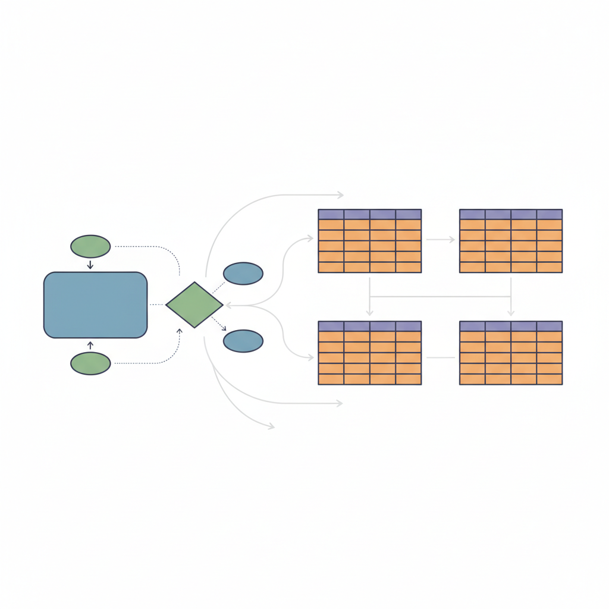
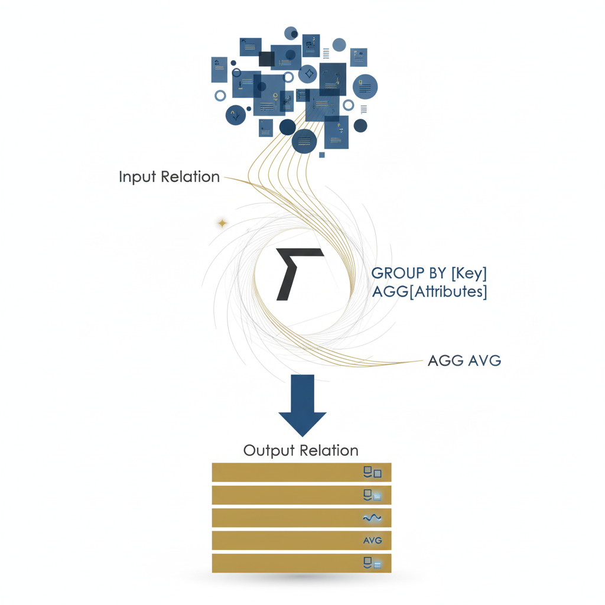
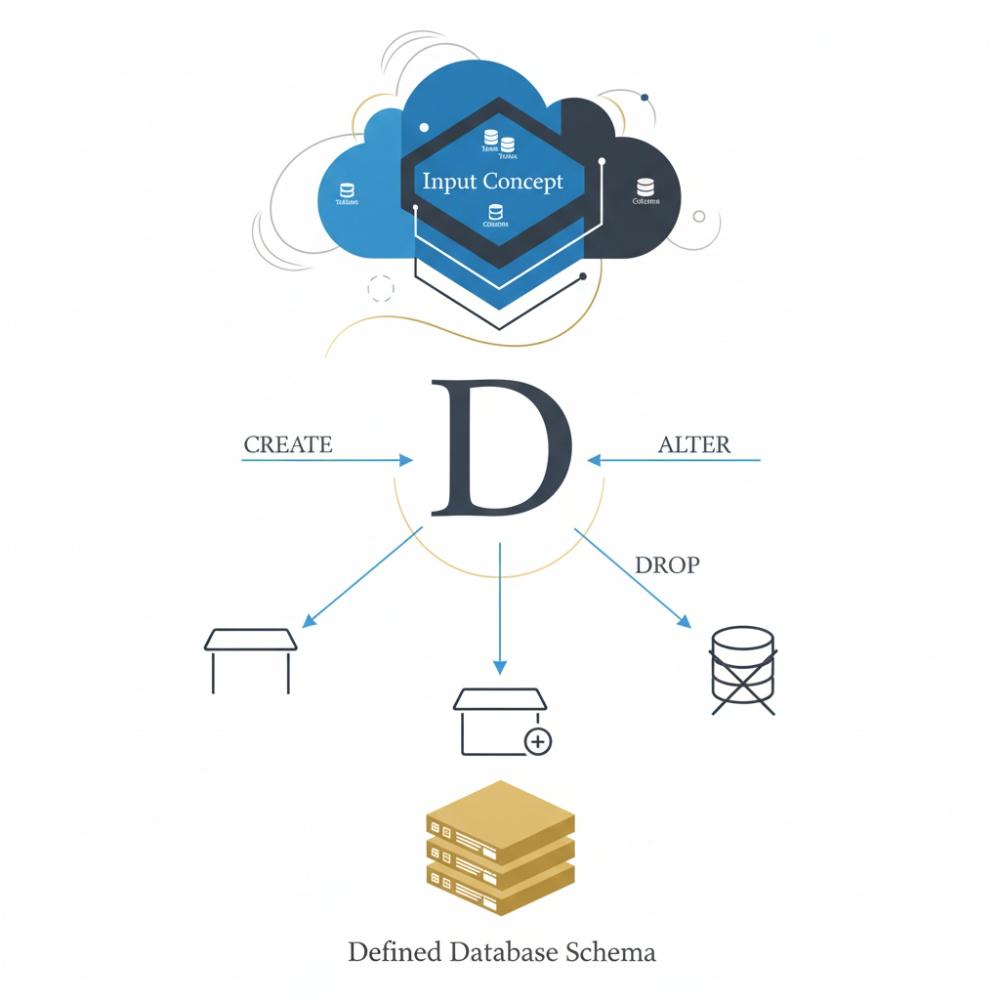
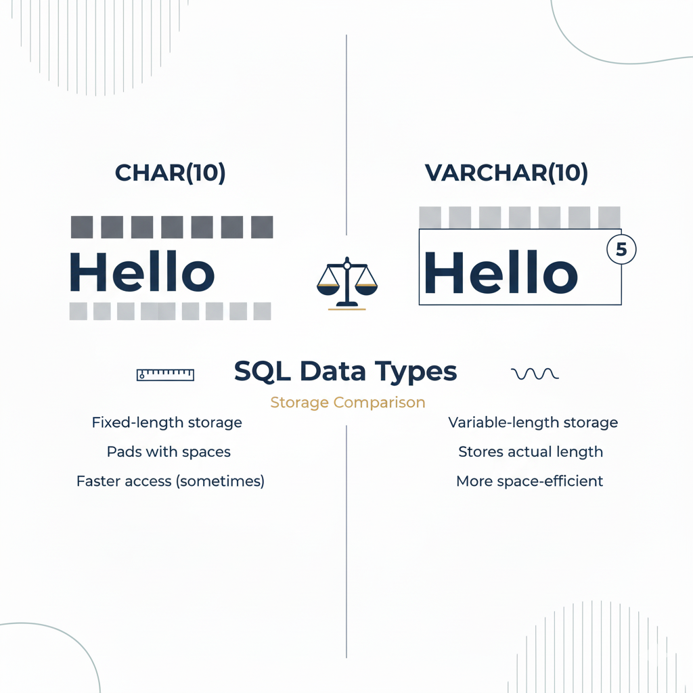
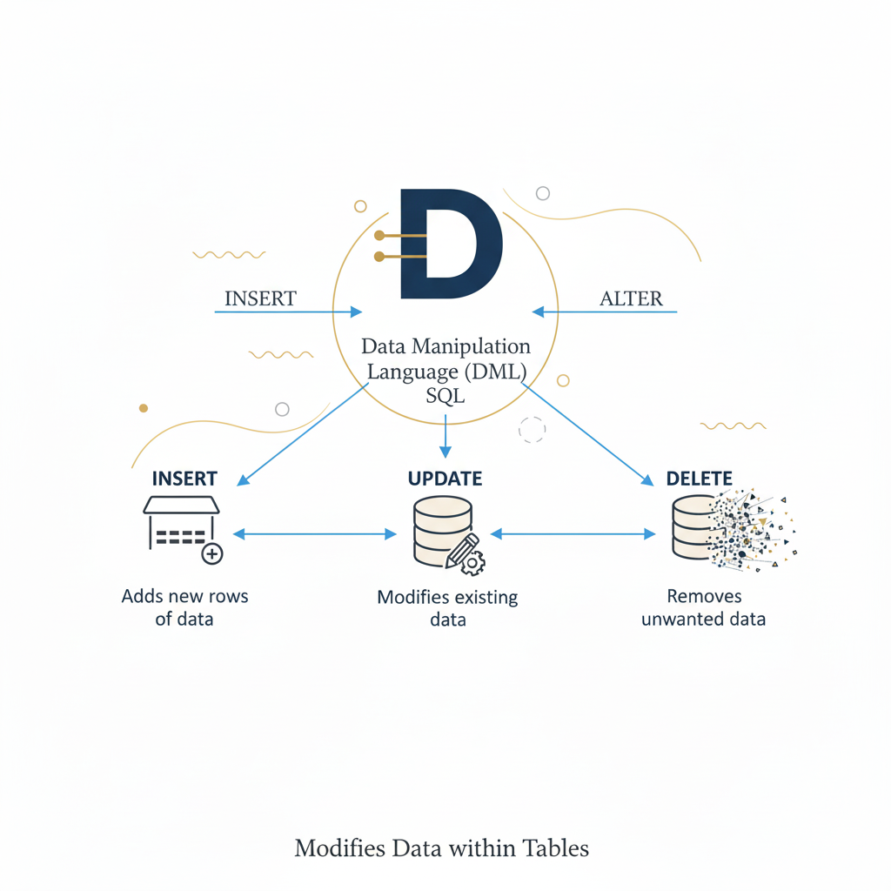
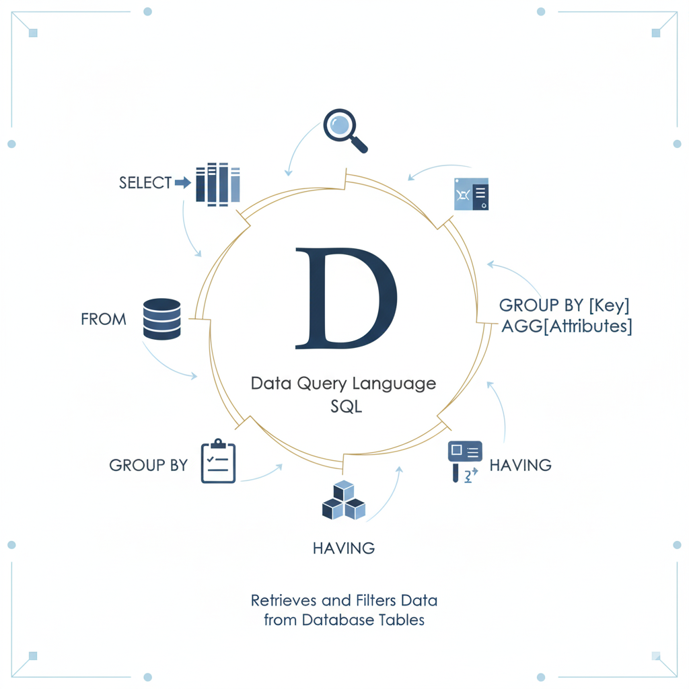
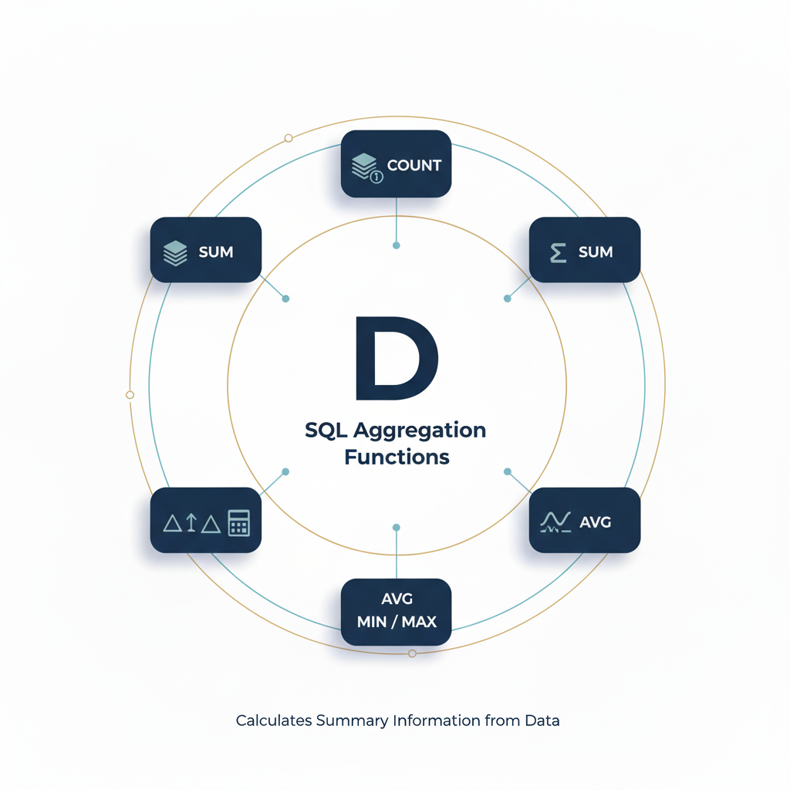

# Kapitel 2: Datenbanken und Anfragesprachen

Dieses zweite Kapitel umfasst die folgenden Abschnitte:

1. Entity-Relationship-Modelle
1. Relationale Datenbanksysteme
1. Structured Query Language

---


## Entity-Relationship-Modelle

Grafische Beschreibung der relevanten Datenstrukturen einer Anwendungsdomäne:

- Hochschulen mit Studierenden, Lektoren und Kursen
- Betriebe mit Mitarbeitern, Projekten und Arbeitspaketen
- Banken mit Kunden, Konten und Transaktionen

---

### Konzepte

Entity-Relationship-Modelle umfassen die folgenden drei Konzepte für die Beschreibung der Datenstrukturen:

- **Entitäten** - Eindeutig identifizierbare Objekte einer Anwendungsdomäne wie der Kunde oder der Kurs
- **Attribute** - Eigenschaften der Objekte wie der der Name eines Kunden oder die Dauer eines Projekts
- **Beziehungen** - Die Verknüpfungen zwischen den Objekten wie die Zuweisung von Lektoren zu Kursen
- **Kardinalitäten** - Die Häufigkeit von Verknüpfungen (ein Kurs hat genau einen Lektor, ein Projekt hat mehrere Mitarbeiter)

---


### Attribute und Bedingungen

Des Weiteren können Bedingungen an Attribute geknüpft werden:

- **Primärschlüssel** - Das Attribut identifiziert die zugehörige Entität eindeutig (z.B. Matrikel-nummer eines/einer Student*in)
- **Eindeutigkeit** - Jede Entität hat für das Attribut einen anderen Wert (z.B. E-Mail-Adresse eines/ einer Student*in)

---


### Zusammengesetzte Primärschlüssel

Auch eine Kombination mehrerer Attribute kann eine Entität eindeutig identifizieren:

- Längen- und Breitengrad identifiziert einen Ort auf dem Globus eindeutig
- Land, Ortschaft, Straße, Hausnummer identifiziert eine Postanschrift eindeutig
- Fluglinie, Quell- und Zielflughafen, sowie Abflugdatum und -uhrzeit identifizieren einen Flug eindeutig

---

### Beziehungen und Kardinalitäten

Des Weiteren kann man anhand der Kardinalitäten (`1` oder `m` bzw. `n`) mehrere Arten von Beziehungen zwischen zwei Entitäten `A` und `B` unterscheiden:

- **`1`-zu-`1` Beziehung** - Jede Entität `A` ist mit genau einer Entität `B` verknüpft und umgekehrt
  - z.B. *Studen\*innen* und seine/ihre *Prüfungsergebnisse*
- **`1`-zu-`n` Beziehung** - Jede Entität `A` ist potenziell mit mehreren Entitäten `B` verknüpft, jede Entität `B` aber nur mit genau einer Entität `A`
  - z.B. *Lektor\*innen* und seine/ihre *Lehrveranstaltungen*
- **`m`-zu-`n` Beziehung** - Jede Entität `A` ist potenziell mit mehreren Entitäten `B` verknüpft und umgekert
  - z.B. *Studiengänge* und ihr *Lehrverstaltungen*

---

<div class="columns">
<div class="two">

### Grundlegende grafische Notation

Das Beispiel auf der rechten Seite zeigt die grafische Notation von Entity-Relationship-Modellen:

- Die **Kästen** repräsentieren die Entitäten der Anwendungsdomäne und deren Attribute
  - Die Attribute sind in den Kästen in **Tabellenform** dargestellt
- Die **Verbindungslinien** repräsentieren die Relationen und deren Kardinalitäten
  - Die Kardinalitäten sind durch Symbole an den **Linienenden** dargestellt

</div>
<div>


</div>
</div>

---

<div class="columns">
<div class="two">

### Grafische Notation der verschiedenen Kardinalitäten einer Beziehung

Die Beziehungen im Diagramm auf der rechten Seite sind wie folgt zu lesen:

- Jedes `A` hat genau ein `B`
- Jedes `B` hat maximal ein `A`
- Jedes `C` hat mindestens ein `D`
- Jedes `D` hat beliebig viele `C`

Die Darstellung definiert somit immer eine untere (`0` oder `1`) und eine obere (`1` oder `n`) Grenze.

</div>
<div>


</div>
</div>

---

<div class="columns">
<div class="three">

### Darstellung von Bedingungen für Attribute

In der erweiterten grafischen Notation sind auch die Bedingungen für die Attribute enthalten:

- `PK` steht für eine Primärschlüssel-Bedingung (Englisch *primary key*)
  - z.B.Name des Studiengangs und Matrikelnummer des Teilnehmers
- `UK` steht für Eindeutigkeits-Bedingung (Englisch *uniqueness key*)
  - z.B. E-Mail-Adresse Teilnehmers

</div>
<div>


</div>
</div>

---

<div class="columns">
<div>

### Darstellung von Kommentaren

Schließlich kann die Darstellung von Entity-Relationship-Modellen noch um Kommentare erweitert werden:

- Kommentare werden als zusätzliche Spalte in der Attributtabelle einer Entität dargestellt
- Kommentare sind somit für die detailliertere Beschreibung von Attributen gedacht

</div>
<div>


</div>
</div>

---

<div class="columns">
<div>

### Vererbung in der Programmierung

Aus der objektorientierten Programmierung kennen wir bereits das Prinzip der Vererbung:

- Elternklasse mit Gemeinsamkeiten und Kindklassen mit Spezifika
- Zum Beispiel haben sowohl Lektoren als auch Kursteilnehmer*innen einen Vornamen und einen Nachnamen
- Jedoch haben nur Lektoren eine Personalnummer

</div>
<div>

```csharp
class Person {
  string Vorname;
  string Nachname;
  string Email;
}

class Lektor : Person {
  string Personalnummer;
}

class Teilnehmer : Person {
  string Matrikelnummer;
}
```

</div>
</div>

---

<div class="columns">
<div>

### Abbildung von Vererbung in Entity-Relationship-Modellen

Prinzipien der Abbildung:

- **Elternentität** mit ID- und Typattribut sowie weiteren gemeinsamen Attributen, **Kindentitäten** mit ID-Attribut und spezifischen Attributen
- **`ist ein`-Beziehungen** (Kardinalität der *Elternentität* ist `genau 1`, Kardinalität der *Kindentität* ist `maximal 1`)


</div>
<div>


</div>
</div>

---


### Aufgaben für das **Selbststudium**

So kannst du dein Verständnis noch weiter vertiefen:

- Erstelle ein Entity-Relationship-Modell für einen produzierenden Betrieb
- Erstelle ein Entity-Relationship-Modell für eine Social Media Plattform

---


## Relationale Datenbanksysteme

Speicherung von Daten in Form von Tabellen und Zugriff über lesende und schreibende Transaktionen:

1. Theorie: Relationale Algebra (Codd 1970)
1. Prototypische Implementierung: System R (IBM 1974)
1. Kommerzialisierung: Oracle (Relational Software 1979)

---

### Relationale Algebra (Edgar Codd, 1970)

Relationale Datenbanksysteme betrachten Datensätze als Tupel einer Relation, welche wiederum eine Teilmenge des kartesischen Produktes der Attributdomänen ist: 

- Domänen $D_i$ mit $i \in \mathbb{N}$ entsprechen den Datentypen der Attribute einer Entität (z.B. `boolean`, `int` oder `string`)
- Relationen $R \subseteq D_1 \times ... \times D_n$ mit $n \in \mathbb{N}$ entsprechen den gesammelten Datensätzen (z.B. E-Mail-Kontakte)
- Tupel $t = (t_1, ..., t_n) \in R$ mit $n \in \mathbb{N}$ entsprechen einzelnen Datensätzen, die in einer Relation enthalten sind (z.B. E-Mail-Kontakt `X`)
- Variablen $t_i \in D_i$ entsprechen den Attributwerten der Tupel $(t_1, ..., t_n) \subseteq R$ mit $i \leq n$ und $i,n \in \mathbb{N}$ sowie Domänen $D_i$

---


### Analogie mit Excel

Hier ist eine einfache Analogie für die Konzepte der relationalen Algebra:

- **Relationen** entsprichen zweidimensionalen Tabellen wie z.B. aus Excel bekannt
- **Domänen** entsprechen den Spalten der Tabelle und deren Datentypen
- **Tupel** entsprechen den einzelnen Zeilen der Tabellenstruktur
- **Variablen** entsprechen den Zellen der Tabellenstruktur

---



### Ableitung aus Entity-Relationship-Modell

Entity-Relationship-Modelle können einfach in Relationen überführt werden:

- *Entitäten* des Entity-Relationship-Modells werden zu *Relationen*
- *Attribute* des Entity-Relationship-Modells werden zu *Domänen*
- *Beziehungen* des Entity-Relationship-Modells werden abhängig von den Kardinalitäten zu Domänen für Fremdschlüssel und Hilfsrelationen

---

### Abbildung von Entitäten und Attributen

Das folgende Beispiel zeigt, wie Entitäten und deren Attribute auf Relationen und Domänen abgebildet werden:

<div class="columns top">
<div>

**Entität *Person***


</div>
<div class="three">

**Relation *Person* ($P \subseteq D_1 \times D_2 \times D_3 \times D_4$)**

| <ins>ID</ins> ($D_1$) | Vorname ($D_2$) | Nachname ($D_3$) | Email ($D_4$) |
|-|-|-|-|
| 1 | Roman | Froschauer | ...@fh-wels.at |
| 2 | Martin | Jordan | ...@fh-wels.at |
| 3 | Georg | Hackenberg | ...@fh-wels.at |
| ... | ... | ... | ... |

</div>
</div>

---

### Abbildung von `1`-zu-`1` Beziehungen

Zusätzliche *Domänen* für Fremdschlüssel in **beiden** Relationen (oder optional nur einer der beiden Relationen auch möglich):

<div class="columns top">
<div>

**ER-Modell**



</div>
<div>

**Relation *Person***

| <ins>ID</ins> | <ins class="fk">Adresse_ID</ins> | Nachname | ... |
|-|-|-|-|
| 1 | 1 | Müller | ... |
| 2 | 2 | Muster | ... |
| 3 | 3 | Maier | ... |
| ... | ... | ... | ... |

</div>
<div>

**Relation *Adresse***

| <ins>ID</ins> | <ins class="fk">Person_ID</ins> | Ort |... |
|-|-|-|-|
| 1 | 1 | Wels | ... |
| 2 | 2 | Linz | ... |
| 3 | 3 | Steyr | ... |
| ... | ... | ... | ... |

</div>
</div>

---

### Abbildung von `1`-zu-`n` Beziehungen

Zusätzliche *Domänen* für Fremdschlüssel in **nur einer** Relation (welche mit der Kardinalität `n` auftritt):

<div class="columns top">
<div>

**ER-Modell**



</div>
<div>

**Relation *Projekt***

| <ins>ID</ins> | Name | ... |
|-|-|-|
| 1 | Projekt A | ... |
| 2 | Projekt B | ... |
| 3 | Projekt C | ... |
| ... | ... | ... |

</div>
<div>

**Relation *Arbeitspaket***

| <ins>ID</ins> | <ins class="fk">Projekt_ID</ins> | Bezeichung | ... |
|-|-|-|-|
| 1 | 1 | Anforderungsanalyse | ... |
| 2 | 1 | Systementwurf | ... |
| 3 | 1 | Umsetzung | ... |
| ... | ... | ... | ... |

</div>
</div>

---

### Abbildung von `m`-zu-`n` Beziehungen

Zusätzliche *Relation* mit *Domänen* für Fremdschlüssel, die einen zusammengesetzten Primärschlüssel ergeben (plus optional weitere Beziehungsattribute):

<div class="columns top">
<div>

**ER-Modell**



</div>
<div>

**Relation *Projekt***

| <ins>ID</ins> | Name | ... |
|-|-|-|
| 1 | Projekt A | ... |
| 1 | Projekt B | ... |
| 1 | Projekt C | ... |
| ... | ... | ... |

</div>
<div>

**Relation *ProPer***

| <ins class="pfk">Pro_ID</ins> | <ins class="pfk">Per_ID</ins> |
|-|-|
| 1 | 1 |
| 1 | 2 |
| 2 | 3 |
|-|-|


</div>
<div>

**Relation *Person***

| <ins>ID</ins> | Nachname | ... |
|-|-|-|
| 1 | Müller | ... |
| 1 | Muster | ... |
| 1 | Maier | ... |
| ... | ... | ... |

</div>
</div>

---


### Relationale Operationen

Für die Auswertung der Daten gibt es folgende Operationen:

- **Unäre Operationen**: Projektion, Selektion und Gruppierung
- **Binäre Operationen**: Vereinigung, Schnittmenge, Differenz, Kartesisches Produkt, Join, Equi-Join, Natural Join, Left/Right/Full Outer Join, Division

---

### Unäre relationale Operationen

Unäre Operatonen arbeiten auf einer Relation $R \subseteq D_1 \times ... \times D_n$ mit $n \in \mathbb{N}$:

<div class="columns top">
<div>

**1. Projektion $\pi_\Delta(R)$**


</div>
<div>

**2. Selektion $\sigma_P(R)$**


</div>
<div>

**3. Gruppierung $\gamma_{\Delta,F}(R)$**


</div>
</div>

---

<div class="columns">
<div class="two">

### Projektion

Gegeben sei eine Relation $R \subseteq D_1 \times ... \times D_n$ sowie eine Teilmenge $\Delta \subseteq \{D_1, ..., D_n\}$ mit $n \in \mathbb{N}$. Wir definieren die Projektion $\pi_\Delta(R)$ wie folgt:

$\pi_\Delta(R) = \{ t_\Delta : t \in R \}$

Hierbei repräsentiert $t$ die Tupel der ursprünglichen Relation $R$ über $\{ D_1, ..., D_n \}$, während $t_\Delta$ das zugehörige Tupel über der Teilmenge $\Delta$ beschreibt.

</div>
<div>


</div>
</div>

---

<div class="columns">
<div class="two">

### Selektion

Gegeben sei eine Relation $R \subseteq D_1 \times ... \times D_n$ sowie ein Prädikat $P: D_1 \times ... \times D_n \rightarrow \mathbb{B}$ mit $n \in \mathbb{N}$. Wir definieren die Selektion $\sigma_P(R)$ wie folgt:

<div class="box">

$\sigma_P(R) = \{ t \in R : P(t) = 1 \}$

</div>

Die Selektion $\pi_P(R)$ liefert also die Teilmenge derjenigen Tupel $t \in R$, welche das Prädikat $P$ erfüllen, d.h. $P(t) = 1$.

</div>
<div>


</div>
</div>

---

<div class="columns">
<div>

### Gruppierung

Gegeben sei eine Relation $R \subseteq A_1 \times ... \times A_m \times B_1 \times ... \times B_k$ mit einer Menge von Gruppierungsattributen $\Delta = \{A_1, ..., A_m\}$ und $m,k \in \mathbb{N}$.

Gegeben sei des Weiteren eine Liste $F = f_1,...,f_n$ von Aggregatfunktionen $f_i: \mathcal{P}(A_1 \times ... \times A_m \times B_1 \times ... \times B_k) \rightarrow C_i$ mit Aggregatdomänen $C_i$ und $n,i \in \mathbb{N}$.

$\mathcal{P}(\cdot)$ repräsentiert hier eine beliebe Teilmenge von Tupeln der Relation $R$.

</div>
<div>


</div>
</div>

---



### Gruppierung (cont'd)

$m,n,k,i \in \mathbb{N}$

$R \subseteq A_1 \times ... \times A_m \times B_1 \times ... \times B_k$ (= Relation)
$\Delta = \{A_1, ..., A_m\}$ (= Gruppierungsattribute)
$F = f_1,...,f_n$ (= Aggregatfunktionen)

Wir definieren die Gruppierung $\gamma_{\Delta,F}(R)$ wie folgt:

<div class="box">

$\gamma_{\Delta,F}(R) = \{ r_{\{A_1, ..., A_m\}} \cup (f_1(x), ..., f_n(x)) :$
$r \in R \wedge x = \{ s \in R : s_{\{A_1,...,A_m\}} = r_{\{A_1,...,A_m\}} \} \}$

</div>

Beachte die Anwendung der Aggregatfunktionen auf die Teilmengen der Tupel $x \subseteq R$.

---

### Binäre relationale Operationen

Binäre relationale Operationen arbeiten auf zwei Relationen $R$ und $S$:

<div class="columns top">
<div>

**1. Identisches Schema**

<div class="box">

$n \in \mathbb{N}$

$R \subseteq D_1 \times ... \times D_n$
$S \subseteq D_1 \times ... \times D_n$

</div>

- Vereinigung
- Schnittmenge
- Differenz

</div>
<div>

**2. Beliebiges Schema**

<div class="box">

$m,n \in \mathbb{N}$

$R \subseteq A_1 \times ... \times A_m$
$S \subseteq B_1 \times ... \times B_n$

</div>

- Kartesisches Produkt
- Join
- Equi-Join

</div>
<div>

**3. Überschneidendes Sch.**

<div class="box">

$m,n,k,i \in \mathbb{N}$

$R \subseteq A_1 \times ... \times B_k$
$S \subseteq B_1 \times ... \times C_n$

</div>

- Natural Join
- Outer Join
- Division

</div>
</div>

---

<div class="columns">
<div class="two">

### Vereingung

Gegeben seien zwei Relationen $R,S \subseteq D_1 \times ... \times D_n$ mit $n \in \mathbb{N}$. Wir definieren die Vereinigung beider Relationen $R \cup S$ wie folgt:

<div class="box">

$R \cup S = \{ t : t \in R \vee t \in S \}$

</div>

Somit beinhaltet die Vereingung der beiden Relationen sowohl alle Tupel aus $R$, als auch alle Tupel aus $S$ (Duplikate existieren **nicht** doppelt).

</div>
<div>


</div>
</div>

---

<div class="columns">
<div class="two">

### Schnittmenge

Gegeben seien zwei Relationen $R,S \subseteq D_1 \times ... \times D_n$ mit $n \in \mathbb{N}$. Wir definieren die Schnittmenge beider Relationen $R \cap S$ wie folgt:

<div class="box">

$R \cap S = \{ t : t \in R \wedge t \in S \}$

</div>

Somit beinhaltet die Schnittmenge der beiden Relationen alle Tupel aus $R$, die gleichzeitig **auch** in $S$ enthalten sind.

</div>
<div>


</div>
</div>

---

<div class="columns">
<div class="two">

### Differenz

Gegeben seien zwei Relationen $R,S \subseteq D_1 \times ... \times D_n$ mit $n \in \mathbb{N}$. Wir definieren die Differenz beider Relationen $R \setminus S$ wie folgt:

<div class="box">

$R \setminus S = \{ t : t \in R \wedge t \notin S \}$

</div>

Somit beinhaltet die Differenz der beiden Relationen alle Tupel aus $R$, die **nicht** gleichzeitig auch in $S$ enthalten sind.

</div>
<div>


</div>
</div>

---

<div class="columns">
<div class="two">

### Symmetrische Differenz

Gegeben seien zwei Relationen $R,S \subseteq D_1 \times ... \times D_n$ mit $n \in \mathbb{N}$. Wir definieren die symmetrische Differenz beider Relationen $R - S$ wie folgt:

<div class="box">

$R - S = (R \setminus S) \cup (S \setminus R$)

</div>

Somit beinhaltet die symmetrische Differenz der beiden Relationen alle Tupel aus $R$, die **nicht** gleichzeitig auch in $S$ enthalten sind, sowie alle Tupel aus $S$, die **nicht** gleichzeitig auch in $R$ enthalten sind.

</div>
<div>


</div>
</div>

---

<div class="columns">
<div>

### Kartesisches Produkt

Gegeben seien zwei Relationen $R \subseteq A_1 \times ... \times A_m$ mit $m \in \mathbb{N}$ und $S \subseteq B_1 \times ... \times B_n$ mit $n \in \mathbb{N}$.

Wir definieren das kartesische Produkt beider Relationen $R \times S$ wie folgt:

<div class="box">

$R \times S : \{r \cup s : r \in R \wedge s \in S \}$

</div>

Somit wird jedes Tupel aus $R$ mit jedem Tupel aus $S$ kombiniert. Die Domänen der beiden Relationen können unterschiedlich sein.

</div>
<div>


</div>
</div>

---

<div class="columns">
<div>

### Join (*Allgemeines Prädikat $P$*)

Gegeben seien zwei Relationen $R \subseteq D_1 \times ... \times D_m$ mit $m \in \mathbb{N}$ und $S \subseteq D_{m+1} \times ... \times D_{m + n}$ mit $n \in \mathbb{N}$.

Gegeben sei des Weiteren ein Prädikat $P: D_1 \times ... \times D_{m+n} \rightarrow \mathbb{B}$ als Funktion über den kombinierten Domänen.

Wir definieren den Join beider Relationen mit Prädikat $R \bowtie_P S$ wie folgt:

<div class="box">

$R \bowtie_P S = \pi_P(R \times S)$

</div>

</div>
<div>


</div>
</div>

---

<div class="columns">
<div>

### Equi-Join (*Spezielles Prädikat $P$*)

Gegeben seien zwei Relationen $R \subseteq D_1 \times ... \times D_m$ mit $m \in \mathbb{N}$ und $S \subseteq D_{m+1} \times ... \times D_{m + n}$ mit $n \in \mathbb{N}$.

Gegeben seien des Weiteren $i,j \in \mathbb{N}$ mit $i \leq m$ und $m < j \leq m + n$.

Wir definieren den Equi-Join $R \bowtie_{i = j} S$ mit Prädikat $P(t) = (t_{\{D_i\}} = t_{\{D_j\}})$ wie folgt:

<div class="box">

$R \bowtie_{i = j} S = \pi_P(R \times S)$

</div>

</div>
<div>


</div>
</div>

---

<div class="columns">
<div>

### Natural Join (Prädikat + Projektion)

Gegeben seien zwei Relationen $R,S$ mit $R \subseteq A_1 \times ... \times A_m \times B_1 \times ... \times B_k$ und $S \subseteq B_1 \times ... \times B_k \times C_1 \times ... \times C_n$ sowie $m,n,k \in \mathbb{N}$.

Wir definieren den Natural Join $R \bowtie S$ der beiden Relationen wie folgt:

<div class="box">

$R \bowtie S = \{ r \cup s_{\{C_1,...,C_n\}} : r \in R \wedge$
$s \in S \wedge r_{\{B_1,...,B_k\}} = s_{\{B_1,...,B_k\}} \}$

</div>

Beachte, dass Duplikate der Domänen $B_1,...,B_k$ ausgeblendet werden.

</div>
<div>


</div>
</div>

---

<div class="columns">
<div>

### Left Outer Join

Gegeben seien zwei Relationen $R,S$ mit $R \subseteq A_1 \times ... \times A_m \times B_1 \times ... \times B_k$ und $S \subseteq B_1 \times ... \times B_k \times C_1 \times ... \times C_n$ sowie $m,n,k \in \mathbb{N}$.

Wir definieren den Left Outer Join $R \triangleright S$ der beiden Relationen wie folgt:

<div class="box">

$R \triangleright S = (R \bowtie S) \cup \{r \cup (\bot,...,\bot) :$
$r \in R \wedge \nexists s \in S : r_{\{B_1,...,B_k\}} = s_{\{B_1,...,B_k\}}\}$

</div>

Tupel aus $R$ **ohne** *Join-Partner* in $S$ sind trotzdem enthalten.

</div>
<div>


</div>
</div>

---

<div class="columns">
<div>

### Right Outer Join

Gegeben seien zwei Relationen $R,S$ mit $R \subseteq A_1 \times ... \times A_m \times B_1 \times ... \times B_k$ und $S \subseteq B_1 \times ... \times B_k \times C_1 \times ... \times C_n$ sowie $m,n,k \in \mathbb{N}$.

Wir definieren den Right Outer Join $R \triangleleft S$ der beiden Relationen wie folgt:

<div class="box">

$R \triangleleft S = (R \bowtie S) \cup \{(\bot,...,\bot) \cup s :$
$s \in S \wedge \nexists r \in R : s_{\{B_1,...,B_k\}} = r_{\{B_1,...,B_k\}}\}$

</div>

Tupel aus $S$ **ohne** *Join-Partner* in $R$ sind trotzdem enthalten.

</div>
<div>


</div>
</div>

---

<div class="columns">
<div>

### Full Outer Join

Gegeben seien zwei Relationen $R,S$ mit $R \subseteq A_1 \times ... \times A_m \times B_1 \times ... \times B_k$ und $S \subseteq B_1 \times ... \times B_k \times C_1 \times ... \times C_n$ sowie $m,n,k \in \mathbb{N}$.

Wir definieren den Full Outer Join $R \otimes S$ der beiden Relationen wie folgt:

<div class="box">

$R \otimes S = (R \triangleright S) \cup (R \triangleleft S)$

</div>

Es sind also Tupel aus $R$ **und** $S$ ohne *Join-Partner* enthalten.

</div>
<div>


</div>
</div>

---

<div class="columns">
<div>

### (Kartesische) Division

Gegeben seien zwei Relationen $R,S$ mit $R \subseteq A_1 \times ... \times A_m \times B_1 \times ... \times B_n$ und $S \subseteq B_1 \times ... \times B_n$ sowie $m,n \in \mathbb{N}$.

Wir definieren die Division $R \div S$ der beiden Relationen wie folgt:

<div class="box">

$R \div S = \{ r_{\{A_1,...,A_m\}} : r \in R \wedge$
$\forall s \in S : r_{\{A_1,...,A_m\}} \cup s \in R \}$

</div>

Die Ergebnisrelation enthält **nur** Tupel, welche **alle** Tupel aus $S$ als *Join-Partner* haben.

</div>
<div>


</div>
</div>

---


### Aufgaben für das **Selbststudium**

So kannst du dein Verständnis noch weiter vertiefen:

- Überführen Sie die Entity-Relationship-Modelle aus dem vorigen Abschnitt in relationale Schemas
- Beschreiben Sie sinnvolle Abfragen auf den relationalen Schemas mittels den relationalen Operationen

---


## Structured Query Language

Standardsprache für die Arbeit mit relationalen Datenbanken bestehend aus drei Teilbereichen:

- **Data Definition Language** für die Verwaltung von Tabellen
- **Data Manipulation Language** für die Verwaltung von Datensätzen
- **Data Query Language** für das Auslesen von Daten

---



### Data Definition Language (DDL)

Die DDL umfasst die folgenden drei Anweisungen in ihren unterschied-lichen Varianten:

- `create table` für das Erstellen von Tabellen
- `alter table` für das Ändern von bereits erstellten Tabellen
- `drop table` für das Löschen von bereits erstellten Tabellen

---

<div class="columns">
<div>

### Anweisung `create table`

Für das Erstellen einer neuen Tabelle müssen die folgenden Informationen angegeben werden:

- Name der neuen Tabelle
- Liste der Spalten inklusive
  - Name,
  - Datentyp und
  - einer Liste von Bedingungen (optional)

</div>
<div>

```sql
create table Tabellenname (

  Spaltenname1 Datentyp [Bedingungen],

  Spaltenname2 Datentyp [Bedingungen],

  Spaltenname3 Datentyp [Bedingungen]

  ...

)
```

</div>
</div>

---

### Auswahl an verfügbaren Datentypen

Speicherung von Zeichenketten, Zahlen, und Datum bzw. Uhrzeit:

<div class="columns top">
<div>

**Zeichenketten**

Daten mit und ohne Zeichencode-Tabelle:

- `BINARY`
- `VARBINARY`
- `CHAR`
- `VARCHAR`

</div>
<div>

**Zahlen**

Unterschiedliche Werte-bereiche und Genauigkeit:

- `BOOLEAN`
- `INT`
- `FLOAT`
- `DOUBLE`
- `DECIMAL`

</div>
<div>

**Datum/Uhrzeit**:

Datum/Uhrzeit getrennt oder kombiniert:

- `DATE`
- `TIME`
- `DATETIME`

</div>
</div>

---



### Unterschiede bei Zeichenketten

Unterscheidung zwischen fixer und variabler Länger der Byte- oder Zeichenketten:

- Fixe Länge ist potenziell schneller beim Zugriff, aber verschwendet Speicherkapazität (z.B. Nutzernamen)
- Variable Länge ist potenziell langsamer beim Zugriff, aber nutzt den Speicher effizienter (z.B. Beschreibungstexte)

---

### Arten von Bedingungen

- `NOT NULL` - Jeder Datensatz muss einen Wert für die Spalte haben (z.B. Preis eines Produktes in einem Web-Shop)
- `UNIQUE` - Jeder Datensatz muss einen **eindeutigen** Wert für die Spalte haben (z.B. Nutzername oder E-Mail-Adresse)
- `PRIMARY KEY` - Der Wert der Spalte(n) identifiziert den Datensatz eindeutig (z.B. Seriennummer eines Produkts)
- `FOREIGN KEY` - Der Wert der Spalte verweist auf einen Datensatz aus derselben oder einer anderen Tabelle (z.B. Produkt einer Kundenrezession)
- `CHECK` - Allgemeiner boolscher Ausdruck, der zur Laufzeit ausgewertet werden muss (z.B. Korrektheit einer E-Mail-Adresse)

---

### Beispiel für Bedingungen

Das folgende Beispiel zeigt den Einsatz von Bedingungen für Spalten:

<div class="columns top">
<div>

**Tabelle für *Lektoren***

```sql
create table Lektor (

  ID int primary key,

  Vorname CHAR(100) not null,

  Nachname CHAR(100) not null

)
```

</div>
<div>

**Tabelle für *Vorlesungen***

```sql
create table  Vorlesung (

  ID int primary key,

  Lektor_ID int foreign key
    references Lektor(ID),

  Name CHAR(100) not null unique,

)
```

</div>
</div>

---

### Zusammengesetzte Primärschlüssel

Und so werden zusammengesetzte Primärschlüssel definiert:

<div class="columns">
<div>

**Tabelle *Projekt***

```sql
create table Projekt (
  ID int primary key,
  ...
)
```

**Tabelle *Mitarbeiter***

```sql
create table Mitarbeiter (
  ID int primary key,
  ...
)
```

</div>
<div>

**Tabelle *Zuordnung***


```sql
create table Zuordnung (
  
  Projekt_ID int foreign key
    references Mitarbeiter(ID),
  
  Mitarbeiter_ID int foreign key
    references Mitarbeiter(ID),

  constraint PK primary key
    (Projekt_ID, Mitarbeiter_ID)

)
```

</div>
</div>

---

### Anweisung `alter table`

Das Schema einer Tabelle kann auch nachträglich noch verändert werden (solange die Bedingungen dadurch nicht verletzt werden):

<div class="columns">
<div>

**Spalte *hinzufügen***

```sql
alter table Projekt
  add column Beginn Time
```

**Spalte *löschen***

```sql
alter table Projekt
  drop column Beginn
```

</div>
<div>

**Spalte *ändern***

```sql
alter table Projekt
  alter column Beginn Date
```

**Spalte *umbenennen***

```sql
alter table Projekt
  rename column Beginn to Anfang
```

</div>
</div>

---


### Anweisung `drop table`

Schließlich können gesame Tabellen auch wieder mit einer einzigen kurzen Anweisung gelöscht werden:

```sql
drop table Projekt
```

Dies funktioniert aber nur, wenn dadurch keine Bedingungen (z.B. Fremdschlüssel) verletzt werden.

---



### Data Manipulation Language

Für die Manipulation der Daten in einer Tabelle stehen die folgenden Anweisungen zur Verfügung:

- `insert into` fügt neue Datensätze in eine Tabelle ein
- `update` aktualisiert bestehende Datensätze einer Tabelle
- `delete from` löscht Datensätze aus einer Tabelle heraus

---

### Anweisung `insert into`

Allgemein müssen mein Einfügen von Datensätzen der **Tabellenname** sowie die **Spaltenwerte** angegeben werden:

```sql
insert into Tabelle (Spalt1, Spalte2, ...) values (Wert1, Wert2, ...)
```

Und hier sind ein paar **konkrete Anwendungsbeispiele** für unsere vorige Projekt- und Mitarbeiterdatenbank:

```sql
insert into Projekt (ID, Name) values (1, "Erstes Projekt")

insert into Mitarbeiter (ID, Vorname, Nachname) values (1, "Hans", "Muster")

insert into Zuordnung (Projekt_ID, Mitarbeiter_ID) values (1, 1)
```

---

### Anweisung `update`

Zunächst wieder die allgemeine Form der Aktualisierungsanweisung mit **Tabellenname**, **Spalten** und neuen **Werten**, sowie einem **Prädikat** für die Auswahl von Datensätzen:

```sql
update Tabelle set Spalte1 = Wert1, Spalte2 = Wert2, ... where Prädikat
```

Und hier sind wieder **konkrete Anwendungsbeispiele** für unsere einfache Projekt-datenbank von vorhin:

```sql
update Projekt set Name = "Neuer Name" where ID = 1

update Mitarbeiter set Vorname = "Neuer Vorname" where ID = 1

update Zuordnung set Projekt_ID = 2 where Mitarbeiter_ID = 1
```

---

### Anweisung `delete`

Schließlich hier auch noch die allgemeine Form der Anweisung für das Löschen von ausgewählten Datensätzen aus **Tabellen** mittels einem **Prädikat**:

```sql
delete from Tabelle where Prädikat
```

Schließlich auch für diesen Fall noch ein paar **konkrete Anwendungsfälle** auf Basis unserer Projektdatenbank:

```sql
delete from Zuordnung where Projekt_ID = 1 or Mitarbeiter_ID = 1

delete from Mitarbeiter where ID = 1

delete from Projekt where ID = 1
```

---



### Data Query Language (DQL)

Hier betrachten wir die folgenden relationalen Operationen sowie die Sortierung als zusätzliche Operation:

- Projektion
- Selektion
- Kartesisches Produkt
- Inner und Outer Join
- Gruppierung
- **Sortierung**

---

### Projektion und Selektion

Zunächst widmen wir uns der Projektion und Selektion:

<div class="columns top">
<div>

**Projektion**

Syntax:

```sql
select Name from Projekt
```

Sematik:

$\pi_{\{Name\}}(Projekt)$

</div>
<div>

**Selektion**

Syntax:

```sql
select * from Projekt where ID = 1
```

Semantik:

$\sigma_{ID = 1}(Projekt)$

</div>
</div>

---

### Kartesisches Produkt

Wenn das kartesische Produkt mehrerer Tabellen gebilet werden soll, müssen die Namen der Tabellen einfach durch Komma getrennt angegeben werden. Das folgende Beispiel berechnet das **vollständige kartesische Produkt**.

Syntax:

```sql
select * from Projekt, Zuordnung, Mitarbeiter
```

Semantik:

$Projekt \times Zuordnung \times Mitarbeiter$

---

### Kartesisches Produkt (mit Selektion)

Im folgende Beispiel wird zusätzlich eine Selektion angewendet, um **nur relevante Kombinationen von Datensätzen** zu erhalten.

Syntax:

```sql
select Name, Vorname, Nachname from Projekt, Zuordnung, Mitarbeiter where
  
  Projekt.ID = Zuordnung.Projekt_ID and Mitarbeiter.ID = Zuordnung.Mitarbeiter_ID
```

Semantik:

$\sigma_P(Projekt \times Zuordnung \times Mitarbeiter)$ mit

$P(t) = (t_{\{Proj.ID\}} = t_{\{Zuord.Projekt\_ID\}} \wedge t_{\{Mitarb.ID\}} = t_{\{Zuord.Mitarbeiter\_ID\}})$

---

### Kartesisches Produkt (mit Selektion und Projektion)

Schließlich lassen sich auch **überflüssige Spalten** über eine Projektion **ausblenden**.

Syntax:

```sql
select Name, Vorname, Nachname from Projekt, Zuordnung, Mitarbeiter where
  
  Projekt.ID = Zuordnung.Projekt_ID and Mitarbeiter.ID = Zuordnung.Mitarbeiter_ID
```

Semantik:

$\pi_\Delta(\sigma_P(Projekt \times Zuordnung \times Mitarbeiter))$ mit

$\Delta = \{Name, Vorname, Nachname\}$ und

$P(t) = (t_{\{Proj.ID\}} = t_{\{Zuord.Projekt\_ID\}} \wedge t_{\{Mitarb.ID\}} = t_{\{Zuord.Mitarbeiter\_ID\}})$

---

### (Inner) Join

Für den (Inner) Join müssen die **Tabellen** angegeben werden, welche mit einander verbunden werden sollen, sowie das **Join-Prädikat**:

Syntax:

```sql
select * from Projekt inner join Zuordnung on

  Projekt.ID = Zuordnung.Projekt_ID
```

Semantik:

$Projekt \bowtie_{ID = Projekt\_ID} Zuordnung$ (es handelt sich hier um einen Equi-Join!)

</div>
<div>

</div>
</div>

---

### Left / Right / Full Outer Join

Und so sehen die Outer Join Varianten in der Sprache SQL aus:

```sql
-- Left outer join

select * from Projekt left join Zuordnung on
  Projekt.ID = Zuordnung.Projekt_ID

-- Right outer join

select * from Projekt right join Zuordnung on
  Projekt.ID = Zuordnung.Projekt_ID

-- Full outer join

select * from Projekt full outer join Zuordnung on
  Projekt.ID = Zuordnung.Projekt_ID
```

---

### Gruppierung

Syntax:

```sql
select Vorname, Nachname, Count(*) from Zuordnung, Mitarbeiter where

  Mitarbeiter.ID = Zuordnung.Mitarbeiter_ID

group by Vorname, Nachname
```

Semantik:

$\gamma_{\Delta,F}(Zuordnung \bowtie_{Mitarbeiter\_ID=ID} Mitarbeiter)$ mit

$\Delta = \{Vorname, Nachname\}$ und $F = f_1$ und $f_1(x) = |x|$

---

### Gruppierung (mit Selektion)

Syntax:

```sql
select Vorname, Nachname, Count(*) from Zuordnung, Mitarbeiter where

  Mitarbeiter.ID = Zuordnung.Mitarbeiter_ID

group by Vorname, Nachname having

  Count(*) > 10
```

Semantik:

$\sigma_P(\gamma_{\Delta,F}(Zuordnung \bowtie_{Mitarbeiter\_ID=ID} Mitarbeiter))$ mit

$\Delta = \{Vorname, Nachname\}$ und $F = f_1$ und $f_1(x) = |x|$ und $P(t) = (|x| > 10)$

---



### Aggregationsfunktionen

Standardmäßig werden die folgenden fünf Funktionen für die Aggregation von Daten bereitgestellt:

- `COUNT(...)` = Anzahl von Datensätzen
- `SUM(...)` = Summe von Zahlenwerten
- `MIN(...)` = Minimum von Zahlenwerten
- `MAX(...)` = Maximum von Zahlenwerten
- `AVG(...)` = Mittelwert von Zahlenwerten

---

### Sortierung

Schließlich bietet SQL auch die Möglichkeit, die Reihenfolge von Daten zu verändern. Hierbei kann sowohl die **Sortierrichtung** angegeben werden, als auch eine **hierarchische Sortierung** nach mehreren Attributen durchgeführt werden:

```sql
select * from Mitarbeiter order by Nachname ASC, Vorname DESC
```

Beachte, dass die **Sortierung in der *relationalen Algebra* nicht berücksichtigt** wird. Dies liegt dara, dass in der relationalen Algebra Tabellen als *Mengen* betrachtet werden, und nicht als *Folgen* oder *Sequenzen* (siehe Kapitel 1).

*Eine Adaption der relationalen Algebra auf Folgen oder Sequenzen wäre jedoch grundsätzlich schon möglich!*

---


### Aufgaben für das **Selbststudium**

So kannst du dein Verständnis noch weiter vertiefen:

- Setzen Sie die vorigen Beispiele und Anfragen in SQLite um
- Analysieren Sie die Daten aus der [SQLite-Beispieldatenbank](https://www.sqlitetutorial.net/sqlite-sample-database/)

Nutzen Sie für die Umsetzung [DB Browser for SQLite](https://sqlitebrowser.org/) oder alternativ [SQLiteStudio](https://sqlitestudio.pl/).

---

### Aufbau der SQLite-Beispieldatenbank

<div class="columns">
<div>

Das Diagramm auf der rechten Seite zeigt den Aufbau der Beispieldatenbank.

Es handelt sich um Daten zu Künstlern, Musikstücken und Verkauf an Kunden.

</div>
<div class="three">


</div>
</div>